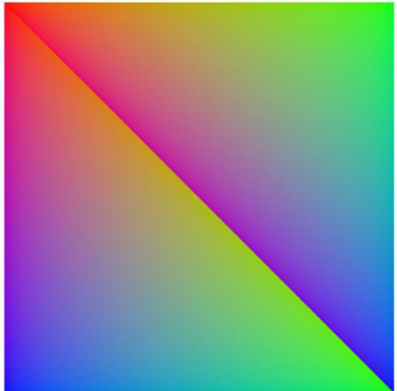
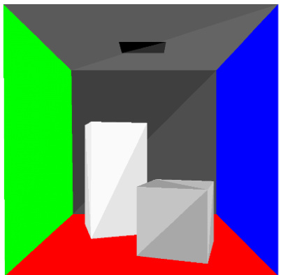
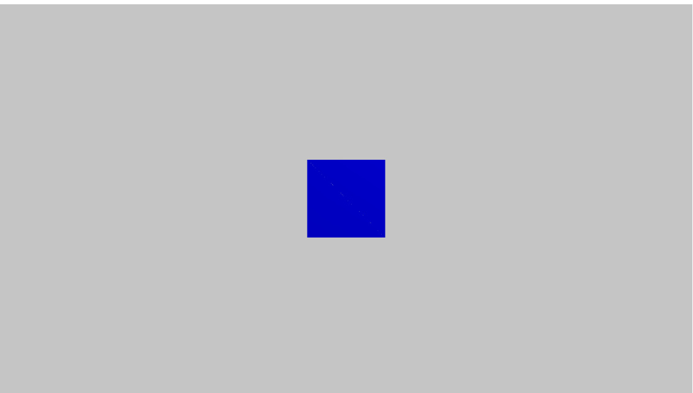
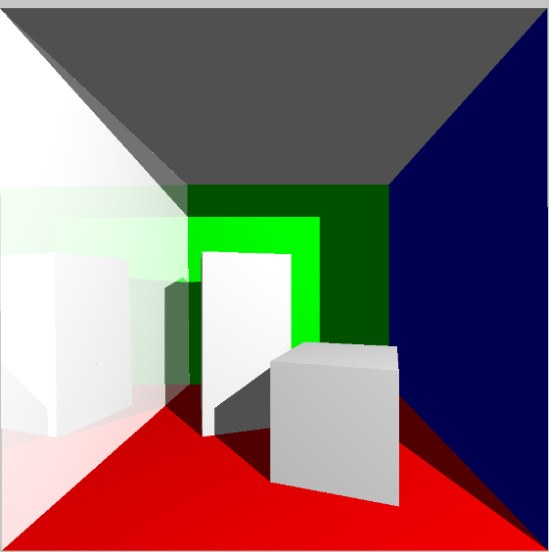
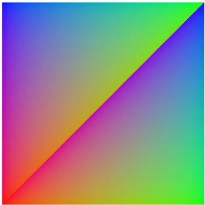
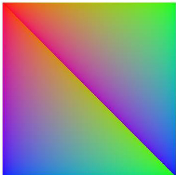
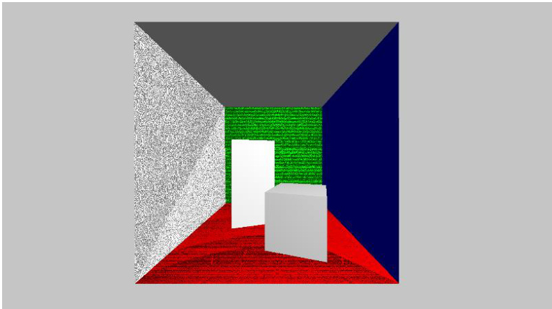
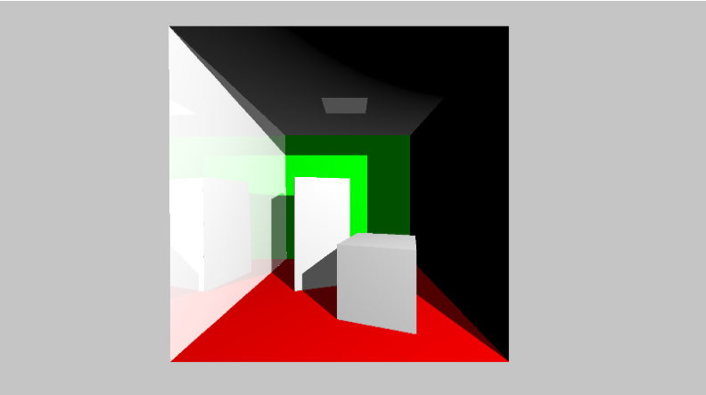

# COMP3011 Computer Graphics Spring 2025 Assessment 1  

# Introduction  

This coursework will test your understanding of the 3D computer graphics rendering pipelines taught during the course. You need to program a rasteriser and a raytracer, which were both covered in the lectures. On Moodle you will find 2 Visual Studio Solutions which are zipped, and which contain everything you will need to complete your coursework. You cannot use any other API.  

# Submission  

You need to submit two separate files to Moodle:  

1. ‘rasterise.h’ for Part A.   
2. ‘raytrace.h’ for Part B.  

# Testing  

Before submitting your code, test it on an A32 lab PC. The marker will download your submitted file from Moodle, add it to the appropriate Visual Studio .sln file, click the Run Button, and it should compile and run without any further interventions.  

# Part A - Rasteriser  

In Part A you need to program a software rasteriser. Only edit ‘rasterise.h’ and submit only that single file to Moodle.  

Look at the code. Open Assessment1A.cpp and look in main(). After some variables for performance analysis are declared, there is a variable to store the path of the OBJ file to render, which is parsed using obj_parse() and the geometry is stored in a variable called tris.  

Have a look at obj_parse() in “do_not_edit.h”. You will see that tiny_obj_loader is loading the vertex data, which is then parsed into lists of positions, normal, and colours. These are used to construct a list of triangles. There are special rules for “cornell2” and “quad” to set the colour of triangles. Do not change any of this file.  

In main(), the list of triangles is passed to the method render(). Then the colour_buffer is saved to a file called “render.bmp”. Run the program and “render.bmp” should be generated, and you can open it in Microsoft paint, and should see that it is an entirely black image.  

Your task is to implement render() and all the necessary functions to rasterise the triangles. Open “rasterise. $\mathrm{h}^{\prime\prime}$ and you will see all the methods you need to implement.  

Whilst you are completing Part A, you are free to use the empty methods in “rasterise. $\mathrm{h}^{\prime\prime}$ or you can write your own methods. Just make sure i) everything you implement is in “rasterise. $\mathrm{h}^{\prime\prime}$ since that is the only file you can submit, and ii) your rasteriser renders the triangles passed into render()from main and make sure you use the method writeColToDisplayBuffer() implemented in “do_not_edit. $\mathrm{h}^{\prime\prime}$ to write to the colour buffer which is written to a file at the end of main().  

You need to implement from the Render loop in Chapter 3 Graphics Programming, Clear the i) colour buffer and ii) depth buffer. colour_buffer and depth_buffer can be found at the top of “do_not_edit.h”.  

You need to implement the following items from the rendering pipeline as can be seen in Chapter 6 Spaces and Chapter 7 The Rendering Pipeline.  

1. Vertex Transformation using a transformation matrix. Note that glm is provided in the .sln so use glm for transformations.   
2. Perspective Division   
3. Viewport Transformation, using PIXEL_W and PIXEL_H that are defined in “do_not_edit.h”   
4. Rasterisation, which must follow the pseudocode in Ch2 Rendering including 1. Calculate the barycentric coordinates 2. Testing if a pixel is inside a triangle. 3. Interpolating the vertex colours and depth values. 4. Merging using the depth_buffer. 5. Writing colours to the colour_buffer using the provided writeColToDisplayBuffer()  

You have been provided with 2 test OBJ files, “quad” and “cornell2”, to test your rasteriser. Start with the simple OBJ file, “quad” first and make sure your rasteriser produces the correct output render. After you are satisfied that it works correctly, then test your program on the more advanced OBJ file, “cornell2”.  

The simple OBJ file, $\mathrm{'}\mathrm{quad"}$ , requires a translation of ${\sf t}=(0,0,-1)$ to the model using glm::translate()and the following parameters for the projection matrix $\pounds_{\mathsf{O V Y}}=\mathsf{\Omega}60.$ .f, zNear $=0.1\mathrm{f}$ , zFar $=10$ .f using glm::perspective(). When you run the program the render of the quad should look like this  

  

The more advanced OBJ file, “cornell2” requires translation of $\tan\left(0.1,-2.5,-6\right)$ to the model using glm::translate() and the following parameters for the projection matrix $\pounds_{\mathsf{O V Y}}=\mathsf{\Omega}_{60}$ .f, zNear $=0$ .1f, zFar $=10$ .f using glm::perspective(). When you run the program the render should look like this  

  

# Part B – Ray Tracer  

In Part B you need to implement a Whitted Ray Tracer without refractions.  

Only edit ‘raytrace.h’ and submit only that single file to Moodle.  

Look at the code. Open Assessment1B.cpp and look in main(). Like Part A there are variables declared for performance analysis. The variable to store the path of the OBJ file to render is a global variable at the top of the file together with an eye position. The OBJ file is parsed using obj_parse() and the geometry is stored in a variable called tris.  

Have a look at obj_parse() in “do_not_edit.h”. Just the same as Part A, a list of triangles is constructed from the data read using tiny_obj_loader. Special case code is there for “cornell2” and “quad”. In particular note that two of the “cornell2” triangles are reflective.  

The method raytrace()is called from main(). Then the pixelBuffer is saved to a file called “render.bmp”. Run the program and “render.bmp” should be generated, and you can open it in Microsoft paint, and should see a completely black image.  

Your task is to implement raytrace() and all the necessary functions to raytrace the triangles. Open “raytrace.h” and you will see all the methods you need to implement. Whilst you are completing Part B, you are free to use the empty methods in “raytrace. $\mathrm{h}^{\prime\prime}$ or you can write your own methods. Just make sure i) everything you implement is in “raytrace. $\mathrm{h}^{\prime\prime}$ since you can only submit that file and ii) your raytracer renders the triangles stored in the vector declared as a global variable called std::vector<triangle> tris in “do_not_edit. $\mathrm{h}^{\prime\prime}$ and make sure you use the method writeCol() found in “do_not_edit. $\mathrm{h}^{\prime\prime}$ to write to the pixelBuffer which is saved to file at the end of main().  

You will need to implement rayTraceImage from the pseudocode on page 3 of Chapter 12 Ray Tracing. Use the method writeCol() found in “do_not_edit. $\mathrm{h}^{\prime\prime}$ to write to the pixelBuffer.  

You will need to calculate a ray direction as it is defined on page 5 of Chapter 12 Ray Tracing. Use 90 degrees in radians for the vfov, and $R=(1,0,0),U=(0,-1,0),F=(0,0,-1)$ .  

You will need to implement a Ray Triangle Intersection test as it is defined on pages 6-8 of Chapter 12 Ray Tracing. You can use FLT_MAX to indicate a ray misses a triangle. Make sure you save the point inside the triangle since you will need to use that point in Shade().  

You will need to implement a trace function using the pseudocode on page 3 of Chapter 12 Ray Tracing. The pseudocode says you should call shade() with the closest triangle. If you want to use the empty methods in “raytrace.h” for your implementation, then you will notice at the top of “do_not_edit. $\mathrm{h}^{\prime\prime}$ that there is a typedef closest_hit, and in “raytrace.h” there is a Shade()method. This should be used as the final parameter when you call trace()for pixel rays and reflection rays.  DoNothing() should be used for testing shadow rays.  You can use the bkgd colour defined in “do_not_edit. $\mathrm{h}^{\prime\prime}$ for pixel rays which hit no triangles.  

You will need to implement Shade as it appears on page 4 of chapter 12 Ray Tracing. Use the colour of any vertex for the surface colour. Ambient should be 0.1. Use the normal of any of the triangle vertices for the surface normal when calculating Diffuse. You do not need to implement the refraction ray for the assessment. Only calculate reflections for reflective triangles and when the recursion depth is less than the max_recursion_depth found in “do_not_edit.h”  

The simple OBJ file “quad” should use eye $=$ (0.f, 0.f, 2.5f) and should produce a render that looks like this  

  

The more advanced OBJ file “cornell2” should use eye $=$ (0.f, 2.5f, 3.0f) and should produce a render that looks like this  

  

# Problem Shooting  

If your rasterised render of the quad looks like this  

  

instead of this  

  

then you probably need to flip the y dimension when you are writing your pixel colours using writeColToDisplayBuffer()by using PIXEL_H - py.  

If your raytraced render of “cornell2” looks something like this  

  

it probably means a secondary ray for shadows or reflections, starting at a point on a triangle, is intersecting with the same triangle. This can be solved by in RayTriangleIntersection() testing if the intersection point value of $t$ is less than a small number, 0.001, and returning FLT_MAX to indicate a miss.  

If your raytraced render of “cornell2” looks something like this  

  

this is probably because you are using diffuse values which are negative when the light is on the wrong side of geometry. Fix this by, when calculating Diffuse light contribution, ensuring the return value of dot() is clamped to 0, like this max(dot(n, l), 0)  

# Marking scheme  

<html><body><table><tr><td></td><td></td><td>Marks</td><td>Time Limit</td></tr><tr><td>Rasterised “quad"</td><td></td><td>12</td><td>10 seconds</td></tr><tr><td>Rasterised “cornell2"</td><td></td><td>3</td><td>60 seconds</td></tr><tr><td>Raytraced“quad"</td><td></td><td>9</td><td>10 seconds</td></tr><tr><td>Raytraced “cornell2"</td><td></td><td>6</td><td>60 seconds</td></tr><tr><td>TOTAL</td><td></td><td>30</td><td></td></tr></table></body></html>  

You will be penalised for the following:  

1. If your program requires any changes to make it run.   
2. If your program crashes.   
3. If you use any API not provided on Moodle in the coursework .sln files.   
4. If there are any apparent visual errors in the rendered images.   
5. If your program requires more than the times listed to execute, excluding compilation.  