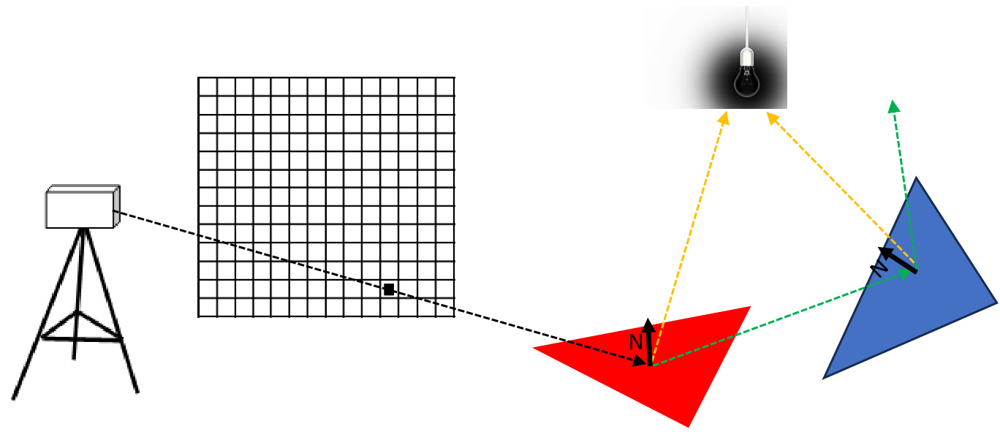
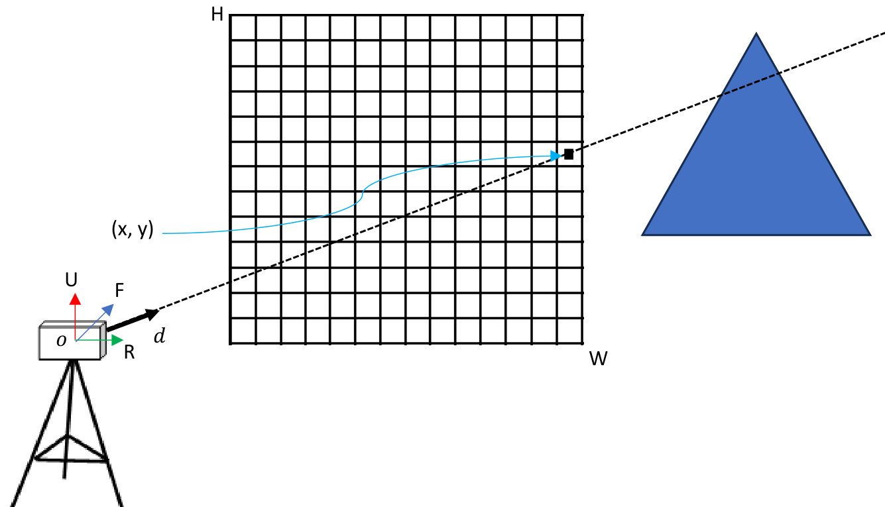
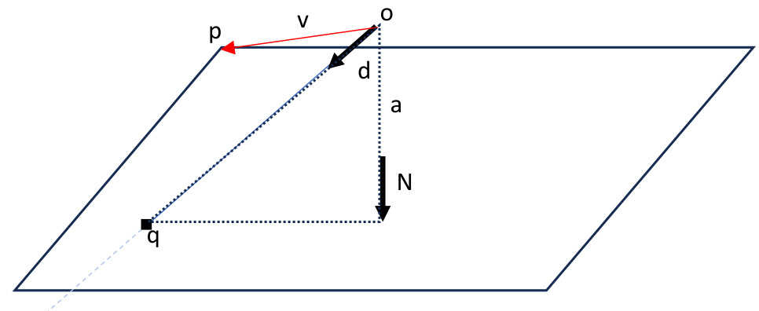
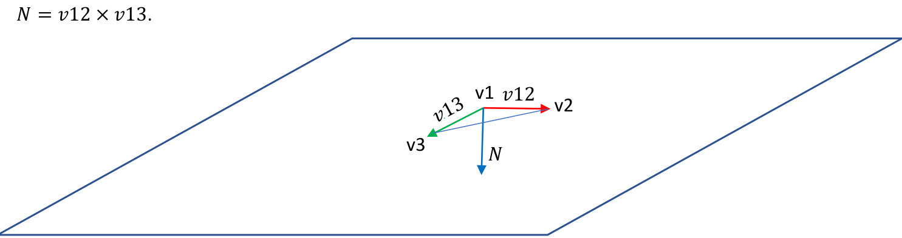
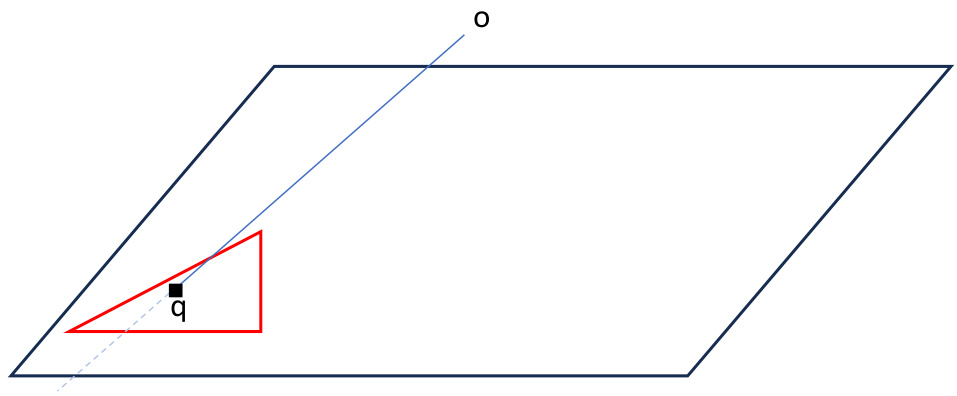
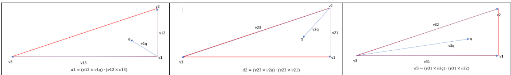
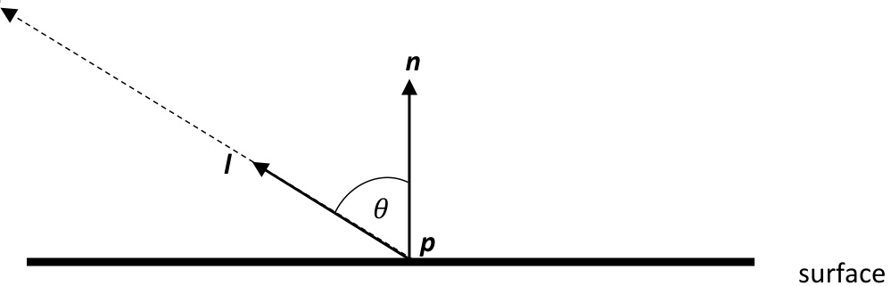

# Chapter 12 Ray Tracing  

# Learning Outcomes  

After studying this chapter, you are expected to be able to  

1. Describe a Whitted Ray Tracer.   
2. Implement a Whitted Ray Tracer using pseudocode and formulae.   
3. Write a function using a formula to generate a ray which passes through a pixel.   
4. Describe the mathematical definitions of a ray and a plane.   
5. Describe how the ray-triangle intersection test works.   
6. Describe how to compute if a ray intersects with a plane.   
7. Describe how point-in-triangle test works.   
8. Describe how ambient light approximates indirect lighting.   
9. Describe how diffuse light is based on Lamberts Law.  

# Ray Tracing  

Ray tracing is an alternative rendering paradigm to rasterisation, which is closely related to the physics of light. It allows rays to originate anywhere and have any direction. For further reading about Ray Tracing, see Chapter 26 of [1].  

light source  

  
Figure 1 – a diagram of recursive ray tracing following a single pixel ray with bounces.  

Calculating the colour of a pixel is achieved by testing a primary ray, shown using a dashed black arrow in Figure 1, passing from the camera through a pixel, and calculating the closest intersecting triangle, shown in red in Figure 1. A new ray is then tested from the intersecting point towards a light source to calculate if the point on the triangle is in shadow, shown using a dashed orange arrow in Figure 1. An additional ray reflecting on the triangle normal, N, is tested to calculate reflected colours, shown using a dashed green arrow in Figure 1. An additional ray can also be refracted, which isn’t shown. These secondary rays for shadows, reflections and refractions can be recursively generated up to a maximum depth, at which point the accumulated ray colour is used for the pixel. This is known as a Whitted Ray Tracer  [2].  

Below is the pseudocode for a Whitted Ray Tracer.  

rayTraceImage ()   
{ for each pixel_y in PIXEL_H { for each pixel_x in PIXEL_W { ray $=$ GetRayDirection for pixel_x, pixel_y color of pixel $=$ trace (ray) } }   
trace()   
{ for each tri in triangles { t $=$ RayTriangleIntersection(tri) save closest_triangle } return shade(closest_triangle)  

<html><body><table><tr><td>shade ( triangle )</td></tr><tr><td></td></tr><tr><td>colour = small ambient amount</td></tr><tr><td></td></tr><tr><td>for each L in lights</td></tr><tr><td></td></tr><tr><td></td></tr><tr><td>trace (ray to L)</td></tr><tr><td>if no intersection</td></tr><tr><td>colour += diffuse light contribution</td></tr><tr><td></td></tr><tr><td>colour += trace （ reflection ray )</td></tr><tr><td></td></tr><tr><td>colour += trace ( refraction ray )</td></tr><tr><td>return colour</td></tr><tr><td></td></tr><tr><td></td></tr><tr><td></td></tr></table></body></html>  

# Calculating a ray direction  

A ray is defined as all points $q$ satisfying  

$$
q(t)=o+d t
$$  

where $o$ is the ray origin, $d$ is the ray direction, and $t$ is a scalar.  

Figure 2 shows the calculation of a ray direction through a pixel.  

  
Figure 2 – calculating a ray that passes through a pixel  

We generate a vector $d$ pointing to each pixel defined by $x$ and $y$ pixel coordinates using this formula  

$$
d=a f\left(\frac{2(x+0.5)}{W}-1\right)R+f\left(\frac{2(y+0.5)}{H}-1\right)U+F
$$  

where $a$ is the aspect ratio $a=W/H,f=t a n\left(\theta/2\right)$ ⁡is a function of the vertical field of view $\theta$ in radians, and $W$ and $H$ are the display dimensions. The vectors $R,U$ and $F$ are the Right, Forward and Up vectors of the camera, $R=(1,0,0),U=(0,1,0),F=(0,0,-1).$  

We normalise $d$ to make it a direction vector, and use the camera position in world space for the origin of the ray $o$ .  

$$
d=\frac{d}{\parallel d\parallel}
$$  

𝑜 = 𝑐𝑎𝑚𝑒𝑟𝑎  

# Ray Triangle Intersection  

To test the intersection of a ray with a triangle, we i) compute if the ray intersects with a plane on which the triangle lies, and if so, then ii) test if the point of intersection is inside the triangle. See section 22.8 in [1] for more details.  

# Ray intersects with a plane  

We compute if a ray intersects with a plane using the equation for a plane. For a known point on the plane $p$ , and a known normal of the plane $N_{\cdot}$ , all points $p^{\prime}$ on the plane satisfy  

$$
\forall p^{\prime}(p-p^{\prime})\cdot N=0
$$  

  
Figure 3 – calculating the point where a ray intersects a plane  

The point $q$ at which the ray intersects the plane is  

$$
q=o+d t
$$  

where  

$$
t={\frac{(p-o)\cdot N}{d\cdot N}}
$$  

Figure 3 shows an imaginary right-angle triangle, where the length of hypotenuse edge is the value $t$ we are computing, and the length of the adjacent edge $a=(p-o)\cdot N$ can be seen. By definition $A\cdot B=$ $|A||B|\cos\theta_{\scriptscriptstyle*}$ , and since $d$ and $N$ are unit vectors, $d\cdot N=\cos\theta$ where $\theta$ is the angle between $d$ and $N$ . It can be seen that $t$ is calculated as the length of the adjacent edge $a$ , divided by the ratio of $a/t$ .  

If we know the 3 vertices of a triangle 𝑣1, $v2$ and $v3$ , we can use any of the vertices as the known point on the plane $p$ .  

  
Figure 4 shows the calculation of the normal of the plane $N$ , by calculating the cross product of two vectors connecting the vertices $v1$ and $v2$ , with 𝑣1 and 𝑣3  

# Point inside triangle  

Once we know the point on the plane $q$ where the ray intersects, then we calculate if that point is inside a triangle whose three points all lie on the plane, as shown in Figure 5.  

  
Figure 4 – using the vertices of a triangle to calculate the Normal of the plane   
Figure 5 - calculate if a point is inside a triangle whose three points all lie on the plane  

This can be achieved by using cross product and dot product as shown in Figure 6.  

  
Figure 6 – calculating is a point is inside a triangle  

The point $q$ is inside the triangle if $d1>0$ and $d2>0$ and $d3>0$ .  

Determining if a point is inside a triangle is an open problem in Computer Graphics [3].  

# Light Contribution  

A small ambient amount accounts for some light reaching surfaces which face away from a light source, as a result of light bouncing off other surfaces before reaching the one that is being calculated. It often approximated using a constant $\pmb{k}$  

$$
\begin{array}{l}{i_{a m b}=k}\ {a m b i e n t=i_{a m b}\cdot s u r f a c e_{-}c o l o u r}\end{array}
$$  

The contribution from a light source, called diffuse, is computed as a term based on Lambert’s Law [4] which states that the reflected light at a point $\pmb{p}$ on a surface is equal to the cosine of the angle between the surface normal $n$ and the vector $l$ from $\pmb{p}$ to the light source, where both $n$ and $l$ are normalized unit vectors. This can be seen in Figure 7.  

$$
i_{d i f f}=n\cdot l=c o s\theta
$$  

light source  

  

  
Figure 7 – an illustration of lamberts law  

# Chapter Index  

ambient, 9   
calculation of a ray direction through a pixel, 5   
compute if a ray intersects with a plane, 6   
diffuse, 9   
intersection of a ray with a triangle, 6   
Lambert’s Law, 9   
point is inside a triangle, 7   
pseudocode for a Whitted Ray Tracer, 3   
Ray tracing, 2   
Whitted Ray Tracer, 2  

# Bibliography  

[1]  T. Akenine-Möller, E. Haines, N. Hoffman, A. Pesce, M. Iwanicki and S. Hillaire, Real-Time Rendering, : A K Peters/CRC Press, 2018.   
[2]  T. Whitted,, "An Improved Illumination Model for Shaded Display," Communications of the ACM, vol. 23, no. 6, p. 343–349, 1980.   
[3]  T. A. Pichler, A. Ferko, M. Ferko, P. Kán and H. Kaufmann, "Precomputed fast rejection ray-triangle intersection," Graphics and Visual Computing, vol. 6, 2022.   
[4] J. H. Lambert, Photometria, sive de mensura et gradibus luminis, colorum et umbrae, Eberhard Klett, 1760.  