# Chapter 14 Lighting  

# Learning Outcomes  

After studying this chapter, you are expected to be able to  

1. Briefly describe light and colour interaction, how surface material reflects light, and how the eye perceives colour.   
2. Explain how the colour of a fragment can be calculated using illumination, the colour of a light source, and the colour of a surface material.   
3. Explain how Phong’s lighting model can be used to calculate the illumination of a point on a surface.   
4. Explain how Phong’s model is not entirely based on Physics, and is not a global illumination model.   
5. Explain how to calculate the three components of Phong’s lighting model, ambient, diffuse and specular, and how they relate to the physical world.   
6. Recognise the repeated use of dot product in lighting calculations.   
7. Explain the difference between the three well known standard light types in computer graphics, directional light, positional light, and spot light.   
8. Compare and distinguish the difference in the effect on the illumination of a fragment by the three well known standard light types in computer graphics, directional light, positional light, and spot light.   
9. Explain how to use Phong’s lighting model to implement the three well known standard light types in computer graphics, directional light, positional light, and spot light.   
10. Illustrate the illumination of a fragment by the three well known standard light types in computer graphics, directional light, positional light, and spot light.   
11. Parametrically define the three well known standard light types in computer graphics, directional light, positional light, and spot light.  

# Colour Perception  

In the physical world, the colour of a surface that the eye perceives depends on the light which is reflected off the surface and reaches the nerves at the back of the eye.  

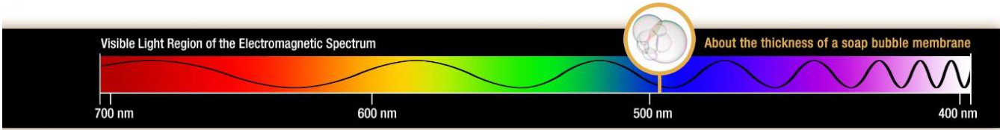  
Figure 1 – visible light spectrum  

Light is made up of photons. Figure 1 shows the visible light spectrum (nasa, 2017). The way we perceive colours starts by nerve cells at the back of the eye becoming excited by photons with different wave lengths.  

There are 3 types of nerve cells in the eye, some which are excited by red light which has a wavelength of 620–750 nm, some which get excited by green light which has a wave-length of 495–570 nm, and some which get excited by blue light which has a wave-length of 450–495 nm.  

We can perceive many different colours by mixtures of these primary colours, red, green and blue.  

The full process of perception of computer graphics is complicated and is the subject of ongoing research (March, Krishnan, Mantiuk, & Watt, 2024) and (Maruszczyk, Denes, & Mantiuk, 2018).  

Light sources emit light of a given colour according to the wavelengths of the photons. White light is made up of equal amount of all wavelengths.  

Surface materials absorb or reflect light depending on the colour of the light and the colour of the material.  

The reflected light is calculated using vector component multiplication, represented using this $\otimes$ symbol.   

<html><body><table><tr><td>Lightcolour</td><td>Surface Colour</td><td>Reflected Colour</td></tr><tr><td>S = (1.0,1.0,1.0)</td><td>m = (1.0,0.0,0.0)</td><td>r = (1.0 * 1.0,1.0 * 0.0,1.0 *0.0) = (1.0,0.0,0.0)</td></tr><tr><td>s = (1.0,1.0,1.0)</td><td>m = (0.0,0.0,0.0)</td><td>r = (1.0 * 0.0,1.0 * 0.0,1.0 *0.0) = (0.0,0.0,0.0)</td></tr></table></body></html>

Figure 2 – some example interactions of light and surface colours  

For example, assuming a white light source and a red material, the reflected light is a red light. This is why red objects appear red in white light. On the other hand, assuming a white light source and a black material, the reflected light colour is a black colour. Black objects appear black in any coloured light. This can be seen in Figure 2.  

The colour of a fragment is calculated as the combined surface and light source colours, which is the colour not absorbed by the surface material, scaled by the total illumination 𝑖 of the fragment  

$$
f r a g m e n t\_c o l o u r=\emph{i}\cdot(l i g h t\_c o l o u r\otimes s u r f a c e\_c o l o u r)
$$  

# Phong lighting  

A local lighting model considers the direct illumination from light sources only, rather than considering light bouncing off other surfaces which is global illumination. In COMP3011 we primarilly study local lighting.  

Phong lighting is a local lighting model that was formulated by Bui Tuong Phong in 1975 (Phong, 1975). It is a rather old lighting model but can still be useful for rendering on low-spec hardware.  

The model specifies that the total illumination of a fragment is the sum of ambient, diffuse and specular components.  

$$
i_{p h o n g}=i_{a m b}+i_{d i f f}+i_{s p e c}
$$  

Phong’s model can then be used to colour the fragment:  

$$
f r a g m e n t\_c o l o u r=i_{p h o n g}\cdot(l i g h t\_c o l o u r\otimes s u r f a c e\_c o l o u r)
$$  

The ambient component $i_{a m b}$ , as described in Chapter 12 Ray Tracing, accounts for some light bouncing off other surfaces before reaching the one that is being calculated, and is often approximated using a constant $\pmb{k}$  

$$
i_{a m b}=k
$$  

The diffuse component $i_{d i f f}$ , as described in Chapter 12 Ray Tracing, is based on Lambert’s Law (Lambert, 1760).  

$$
i_{d i f f}=n\cdot l=c o s\theta
$$  

The specular component $i_{s p e c}$ represents highlights, which give an indication of the location of a light source. It states that reflected light at a point $\pmb{p}$ on a surface is equal to the cosine of the angle between the reflected light vector $r$ around the surface normal $n$ and the vector $v$ from $\pmb{p}$ to the viewer, where both $r$ and $v$ are normalized unit vectors.  

$$
\begin{array}{r}{i_{s p e c}=r\cdot v=c o s\rho}\end{array}
$$  

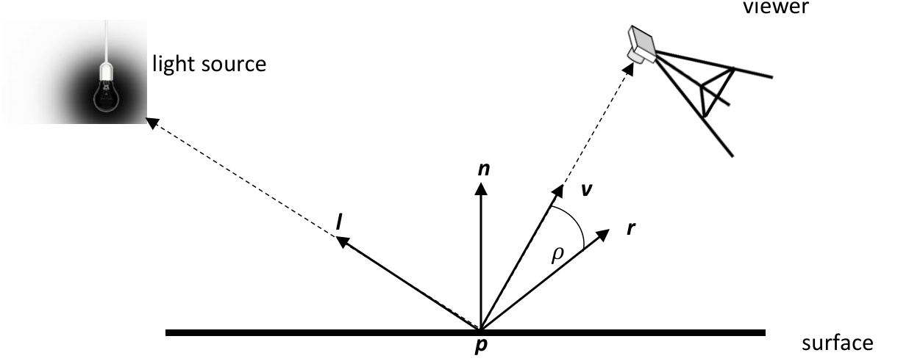  
Figure 4 – an illustration of specular light  

The viewer’s location is a part of the calculation for specular, as can be seen in Figure 4, so the reflected light scatters mostly towards the viewer.  

The specular component is modified by a shininess parameter, 𝑠ℎ𝑖  

$$
i_{s p e c}=(r\cdot v)^{s h i}=(c o s\rho)^{s h i}
$$  

where $1\le s h i\le256$ . The larger the value of 𝑠ℎ𝑖 the faster the specular intensity decreases to 0 as the angle between the reflected light $r$ and view direction $v$ increases.  

The specular component is not based on physics like diffuse, however it looks acceptable and has been used in lighting for decades. Physical Based Rendering is a more recent development which is modelled on Physics, more information can be found here (Akenine-Möller, Haines, & Hoffman, 2018 ) (Pharr, 2010).  

The phong model can be elaborated to account for different light source types.  

# Directional Light  

A directional light is considered to be infinitely away from the scene. The sun can be thought of a directional light because it is so far away that its effect appears to just have a direction.  

Since this type of light source does not have as position then all fragments are lit with the same illumination regardless of their position. This can be seen in Figure 5.  

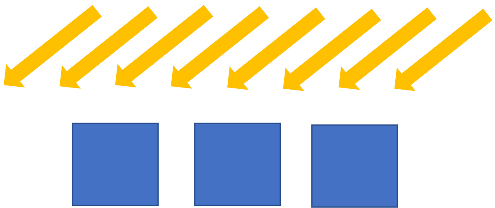  

A directional light is defined by  

1. a colour vector   
2. a direction vector, $l=(l_{0},l_{1},l_{2})$  

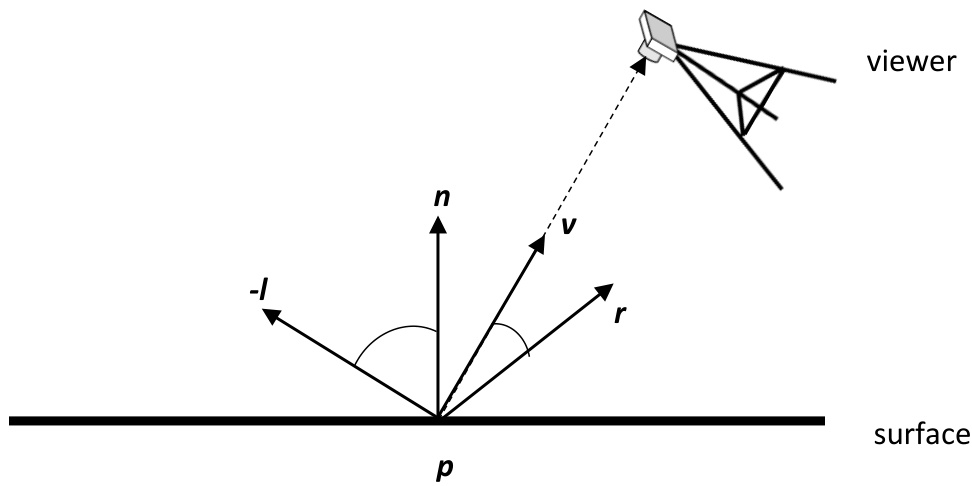  
Figure 6 – an illustration of calculating a directional light  

Phong’s model can be used to calculate the total illumination of a fragment by a directional light using the scheme shown in Figure 6 and using equation (1).  

Phong’s model is calculated as  

$$
i_{p h o n g}=i_{a m b}+i_{d i f f}+i_{s p e c}
$$  

The ambient component is set to a constant $\pmb{k}$  

$$
i_{a m b}=k
$$  

The diffuse component is the dot product of the normal of the fragment with the light direction from the definition of the light  

$$
i_{d i f f}=m a x(n\cdot-l,0)
$$  

The specular component is calculated as the dot product of the reflected light and the vector to the viewer, raised to the power of 𝑠ℎ𝑖  

$$
i_{s p e c}=m a x(r\cdot v,0)^{s h i}
$$  

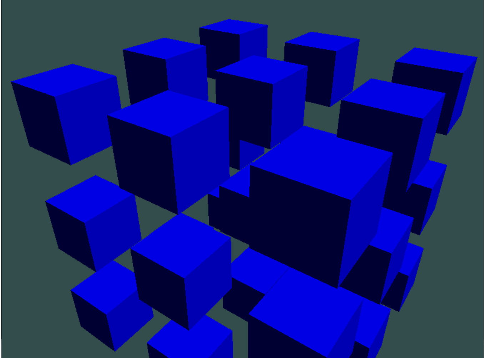  
Figure 7 – cubes illuminated by a directional light  

Figure 7 shows surfaces of rendered cubes which are illuminated by a directional light. The top face of every cube is illuminated by the same amount because the light does not have a position.  

# Positional Light  

A positional light has a position and therefore is a measurable distance away from each of the fragments in the scene. A light attached to the ceiling in the room you are now sitting in can be thought of as a positional light. The illumination of fragments relates to their positions relative to the light as can be seen in Figure 8.  

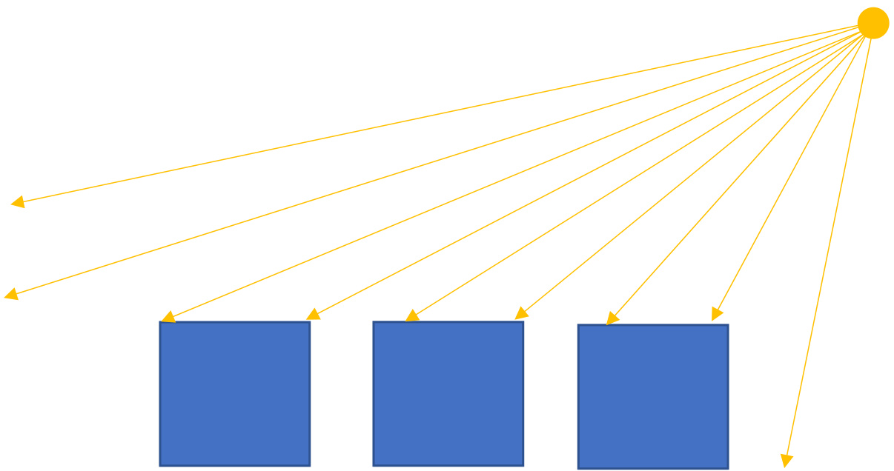  
Figure 8 - the effect of a positional light  

A positional light is defined by:  

1. a colour   
2. a position, 𝑙𝑖𝑔ℎ𝑡_𝑝𝑜𝑠   
3. constant attenuation, $a t t_{c}$   
4. linear attenuation, 𝑎𝑡𝑡𝑙   
5. quadratic attenuation, $a t t_{q}$  

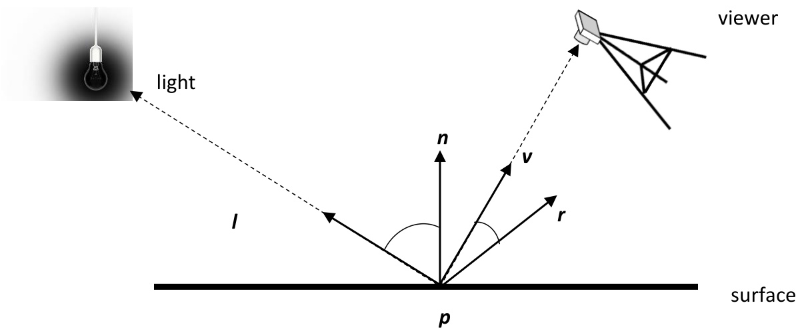  
Figure 9 - an illustration of calculating a positional light  

Phong’s model can be used to calculate the total illumination of a fragment by a positional light in more or less exactly the same way as it was used for calculating the illumination by a directional light. This scheme be seen in Figure 9.  

Phong’s model is now calculated as  

$$
i_{p h o n g}=(i_{a m b}+i_{d i f f}+i_{s p e c})*a t t e n u a t i o n
$$  

Since a positional light has a position, we can use the attenuation value to scale the illumination. The illumination of a fragment based on its distance to a light source is called attenuation:  

$$
a t t e n u a t i o n=\frac{1}{a t t_{c}+(a t t_{l}*d)+(a t t_{q}*d^{2})}
$$  

where $d$ is the is the distance between the fragment and the light source. Since the light source has a position then fragments are lit with varying amount of illumination based on the distance from the light source.  

Since a positional light has a position instead of a direction, the light direction needs to be calculated using the fragment position and light position  

$$
\begin{array}{l}{l=n o r m a l i s e(l i g h t\_p o s-p)}\ {\qquad}\ {i_{d i f f}=\operatorname*{max}{(n\cdot l,0)}}\end{array}
$$  

In Figure 10 we can see that the surface points which are closer to the light are illuminated more than those surface points further from the light. The light itself is on the far right of the image and is indicated with a red circle.  

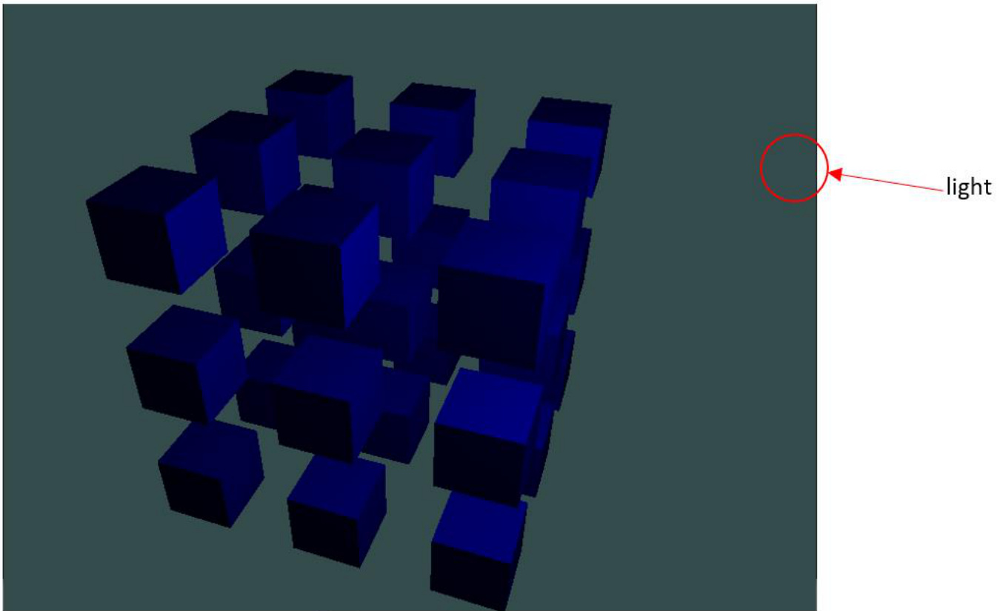  
Figure 10 - cubes illuminated by a positional light.  

# Spot Light  

A spot light is a positional light which emits light in a cone shape pointing in a direction. Using a torch in a dark forest at night is a good way to visualise a spot light.  

Any fragments that are inside of the cone are illuminated by the spot light, and any fragments that are outside of the cone are not illuminated by the spot light.  

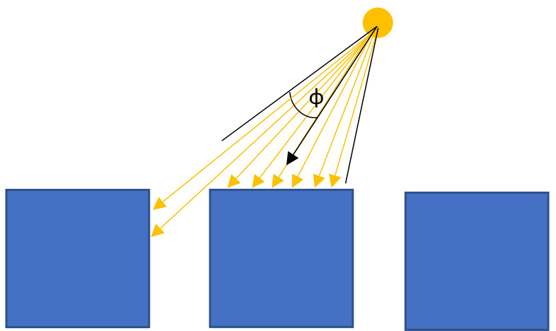  
Figure 11 - the effect of a spot light  

A spot light is defined by:  

1. a colour   
2. a position, 𝑙𝑖𝑔ℎ𝑡_𝑝𝑜𝑠   
3. a direction, 𝑠𝑝𝑜𝑡_𝑑𝑖𝑟   
4. a cutoff cone parameter, $\varphi$   
5. constant attenuation, $a t t_{c}$   
6. linear attenuation, $a t t_{l}$   
7. quadratic attenuation, $a t t_{q}$  

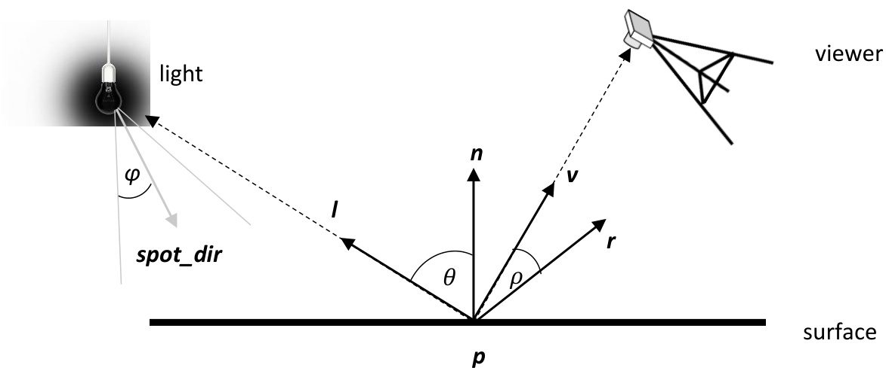  
Figure 12 - an illustration of calculating a spot light.  

To calculate if the fragment at position $p$ is lit by the spot light, we need to calculate the dot product of the vector pointing towards the light with the vector of the pointing towards direction of the light.  

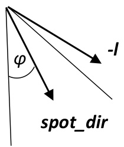  
Figure 13 – testing if a fragment is inside the spot light cone.  

Then check if the computed angle is smaller than the cut off angle 𝑐𝑜𝑠 $\varphi$ of the cone of the spot light as can be seen in Figure 13.  

Phong’s model can be used to calculate the total illumination of a fragment by a spot light in more or less exactly the same way as it was used to calculate the total illumination of a fragment by a positional light. This can be seen in Figure 12. The only difference is that Phong’s model is made up of  

$i_{p h o n g}=(i_{a m b}+i_{d i f f}+i_{s p e c})*a t t e n u a t i o n$ if the fragment 𝐢𝐬 lit by the spot light $i_{p h o n g}=i_{a m b}*$ 𝑎𝑡𝑡𝑒𝑛𝑢𝑎𝑡𝑖𝑜𝑛 if the fragment 𝐢𝐬 𝐧𝐨𝐭 lit by the spot light  

In Figure 14 we can see that one surface has been illuminated by the cone of the spot light. The light itself is indicated with a red circle, and it’s direction is pointing straight downwards.  

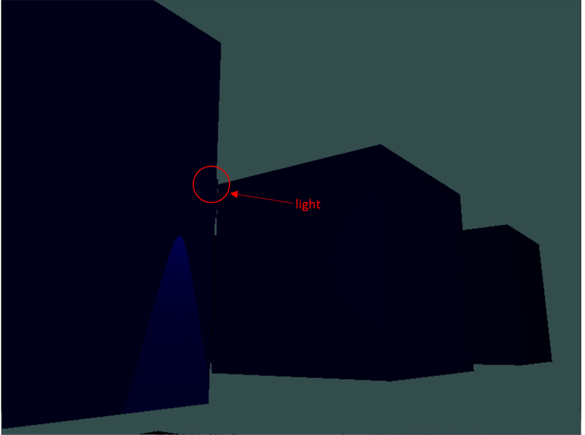  
Figure 14 - cubes illuminated by a spot light.  

# Chapter Index  

ambient, 3   
diffuse, 3   
directional light, 4   
global illumination, 3   
local lighting, 3   
Phong lighting, 3   
positional light, 7   
specular, 3   
spot light, 9  

# Bibliography  

Akenine-Möller, T., Haines, E., & Hoffman, N. (2018 ). Real-Time Rendering (Fourth ed.). : A K Peters/CRC Press.   
Lambert, J. (1760). Photometria, sive de mensura et gradibus luminis, colorum et umbrae. Eberhard Klett.   
March, J., Krishnan, A., Mantiuk, R., & Watt, S. (2024). Impact of focus cue presentation on perceived realism of 3-D scene structure: implications for scene perception and for display technology. Journal of Vision, To appear.   
Maruszczyk, K., Denes, G., & Mantiuk, R. (2018). Improving Quality of Anti-Aliasing in Virtual Reality. (pp. 1-3). : .   
nasa. (2017, August 21). Visible Light. Retrieved March 8, 2023, from Nasa Science: https://science.nasa.gov/ems/09_visiblelight   
Pharr, M. (2010). Physically Based Rendering: From Theory to Implementation. : .   
Phong, B. (1975). Illumination for Computer Generated Pictures. Communications of the ACM, 18(6), 311-317.  