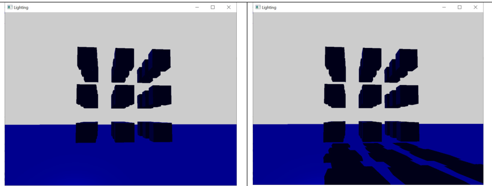
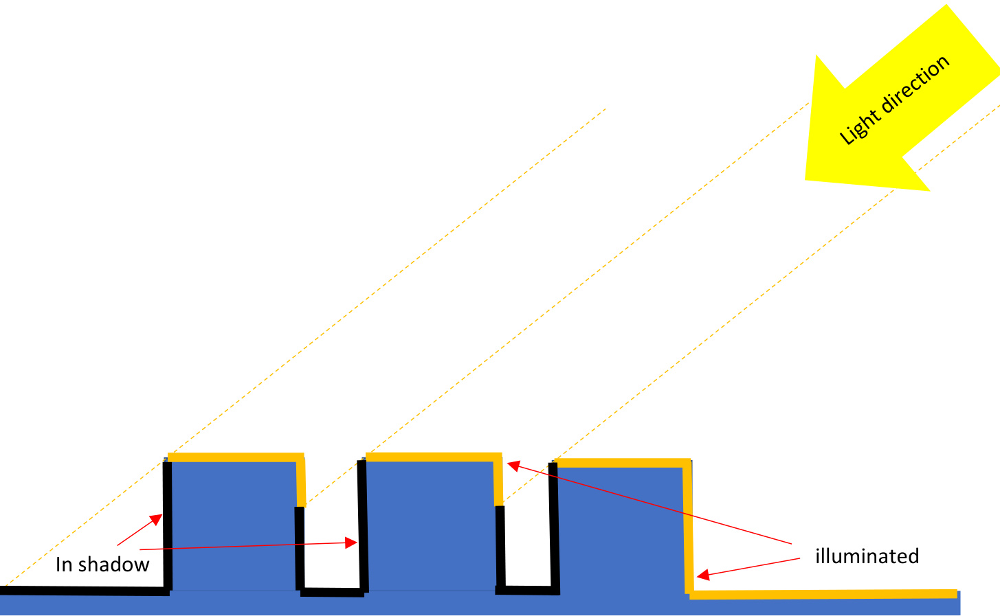
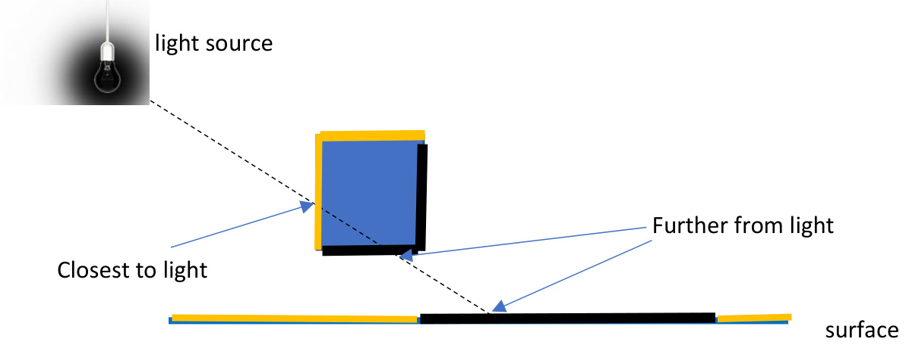
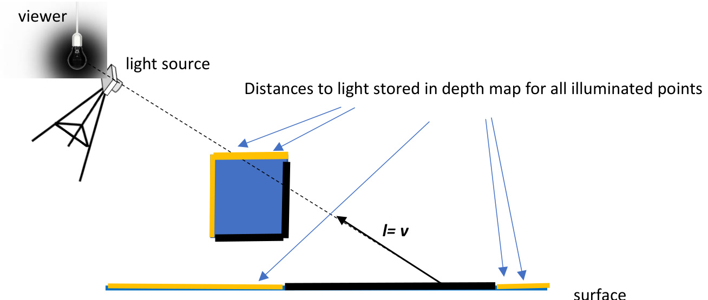
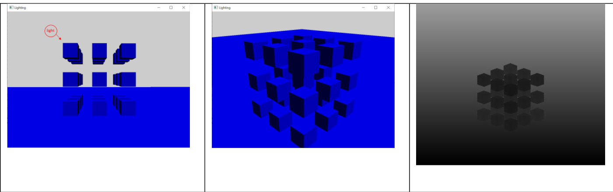
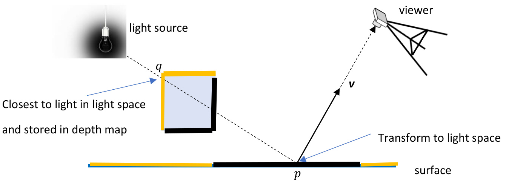

# Chapter 15 Shadows  

# Learning Outcomes  

After studying this chapter, you are expected to be able to  

1. Recognise that shadows improve perception of 3D graphics, and also enhance mood.   
2. Recognise that surfaces hidden from a light source will not be illuminated directly and instead are in shadow.   
3. Recognise that mathematically the point which is closest to the light source along a ray of light is illuminated by that light.   
4. Describe how a depth map is computed by rendering geometry from the position of the light and keeping a copy of the resulting z-buffer.   
5. Recognise that the depth map stores the distances of the closest points to the light in projected light space.   
6. Construct a light space transformation matrix.   
7. Transform a point to projected light space using the light space transformation matrix.   
8. Recognise that for a fragment in projected light space, the z-value is the distance to the light in light space.   
9. Recognise that for a fragment in projected light space, the x-value and y-value coordinates can be used to sample the depth map.   
10. Recognise that if a fragment’s z-value is greater than the depth map corresponding to the fragment position, then that fragment is in shadow, otherwise it is illuminated.   
11. Describe the entire shadow mapping process.  

# Introduction  

Shadows are an important element in computer graphics due to the improvement they make in the correct perception of a scene.  

Figure 1 shows a scene with cubes suspended above a floor. On the left of Figure 1 it appears as though the cubes are in contact with the floor, but as can be seen on the right of Figure 1, which is easier to perceive accurately when rendered with shadows, the cubes are in fact not in contact with the floor.  

  
Figure 1 – a scene rendered without shadows and with shadows.  

Shadows also change the mood of rendered imagery.  

# Surfaces in Shadow  

A shadow is cast when a physical object blocks the light rays emitted from a light source. Blocked surfaces will not be directly illuminated, and instead be in shadow.  

  
Figure 2 – hidden surfaces are in shadow.  

This can be seen in Figure 2, which shows a directional light illuminating geometry with shadows cast by geometry blocking the light rays emitted by that light. Recall from Chapter 14 that a directional light is defined by a colour and a direction towards which the light is shining.  

See Figure 3. Mathematically, the surface point which is closest to a light source along a ray of light emitted by the light source is illuminated by that light, shown as the yellow surface point. All other surface points along that ray of light are in shadow, as can be seen by the black surface points. This is also seen in Ch 12 Ray Tracing, where a point is illuminated by a light source if a ray to the light intersects no geometry.  

  
Figure 3 – fragments which are illuminated or in shadow.  

This can be calculated by computing intersection points of all the visible geometry with a light ray, and only illuminating the fragment which is closest to the light source. This is effectively how ray-traced shadows work (Whitted, 1980).  

# Shadow Mapping  

A different process, which works with rasterisation, is called shadow mapping (Williams, 1978).  

Recall the rendering pipeline from Ch7 - The Rendering Pipeline. After the merging stage the z-buffer will store the z-values of the fragments which are visible, i.e. closest to the camera. This can be useful for the purpose of calculating fragments that should be illuminated or in shadow.  

Calculating the distance of points from the light source can be achieved by rendering geometry from the position of the light and keeping a copy of the resulting z-buffer in a depth map. After this process the depth map will store the depth of fragments which are closest to the light source and therefore are illuminated. This can be seen by the yellow fragments in Figure 4, where you can imagine rendering the geometry from the position of the light source.  

  
Figure 4 - Distances to light stored in depth map for all illuminated points.  

# Depth Map  

As an example, suppose we have a set of cubes, and a light positioned as shown by the red circle on the left in Figure 5.  

First render the geometry from the position of the light, so that the point of view of the render is as shown in the centre of Figure 5.  

  
Figure 5 – A scene with corresponding depth map.  

We then keep a copy of the resulting z-buffer in memory called a depth map, shown in the right-hand image of Figure 5. The depth map is essentially a render of the scene from the point of view of the light, but with depth values instead of colour values. Larger distances in the depth map have values closer to 1, which can be visualized as white, and smaller distances in the depth map have values closer to 0, which can be visualized as black. This means that the top corner of cubes closest to the light position are drawn darker than the floor, which is further from the light position.  

The depth map stores the distance of fragments to the light source, which are closest to the light source.  

# Light space transformation matrix  

To render geometry from the point of view of the light we need a transformation matrix.  

During rendering we normally construct a model matrix to transform a point to world space, a view matrix to transform a point to view space, that is with the point in front of the viewer, and finally a projection matrix. These 3 matrices can be combined to project a point in the rendering pipeline, in the vertex shader.  

If we replace the view matrix with a light matrix, to transform a point to light space, that is with the point in front of the light, then we have a combined light space transformation matrix. This matrix can be used to transform geometry to light space to render the geometry from the position of the light, as shown in Figure 4.  

The light space matrix can also be used to transform any point, including fragments, to light space.  

  
Figure 6 – comparing distances in light space.  

In Figure 6, point $p$ is the fragment that is being shaded. In the fragment shader we can calculate if $p$ is illuminated or not by first transforming $p$ to light space using the light space transformation matrix.  

The z-value of that transformed fragment is the distance to the light in light space.  

The x-value and y-value coordinates of that transformed fragment are the coordinates in the depth map. These coordinates can be used to reference the value in the depth map at that coordinate which is the depth of the fragment, $q$ in Figure 6, the closest to the light source and therefore illuminated.  

If the distance of $p$ to the light in light space is greater than the distance of $q$ to the light, then point $p$ is in shadow, otherwise point $p$ is illuminated. The distance of $p$ to the light cannot be less than the distance of $q$ to the light, since we already computed the closest fragments to the light, which is $q$ .  

This is how we can calculate if $p$ is illuminated or not, in the fragment shader, in a rasterisation pipeline.  

# Chapter Index  

depth map, 5   
light space transformation matrix, 7   
ray-traced shadows, 4   
shadow mapping, 5  

# Bibliography  

Whitted, T. (1980). An improved illumination model for shaded display. Communications of the ACM, 23(6), 343–349.  

Williams, L. (1978). Casting curved shadows on curved surfaces. SIGGRAPH, 12(3), 270-274.  