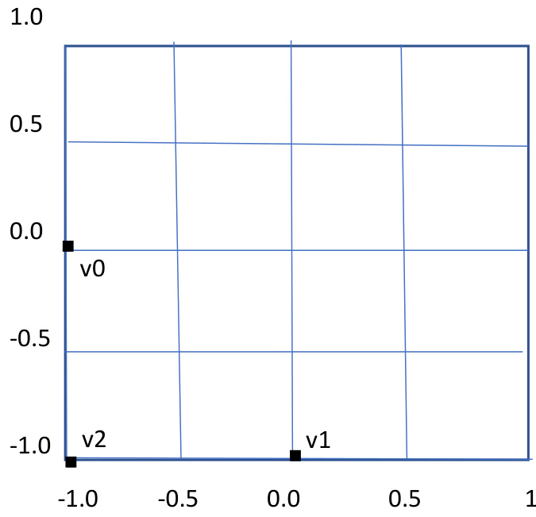

# Chapter 2 Rendering  

# Learning Outcomes  

After studying this chapter, you are expected to be able to  

1. Define terminology commonly used in computer graphics, such as rendering, vertex, fragment, frame buffer and   
shader.   
2. List the 5 main steps of rendering.   
3. Recognise a simple example of vertex specification written in C.   
4. Describe how triangle primitives are assembled.   
5. Use the rasterisation pseudocode to implement a rasteriser.   
6. Use Barycentric coordinates to calculate whether a point is inside a triangle.   
7. Use the implicit line equation to calculate Barycentric coordinates $\upalpha$ , $\upbeta$ and γ.  

# Rendering  

You can read more about rendering in Chapter 1, 2 and 3 of [1].  

Rendering is the process of drawing images on the computer display.  

Graphics programmers start with models, made up of 3-dimensional geometry, which need to be rendered to a 2- dimensional display.  

Models are constructed using primitives, including points, lines, and n-sided polygons. In COMP3011 we focus on models made up of triangles, which are 3-sided polygons. We focus on triangles because graphics hardware is optimised for rasterising triangles, and because artists often use triangles for modelling.  

In Figure 1 you can see triangles repeatedly rendered as wireframe, that is just by drawing the lines connecting the vertices. When models are constructed from many triangles the image becomes richer and more detailed. Complex images are made up of millions of triangles. The model in Figure 1 is made from 414,574 triangles, available from [2], and is rendered using Microsoft 3D Viewer.  

  
Figure 1 – A model constructed from many triangles.  

Triangles are made from 3 points, each of which is called a vertex. Each vertex has a position in 3D space and so is represented as a vector. Recall from Linear Algebra that a vector is a point in space and can be represented geometrically. A vector can be specified in row-major form, e.g.  

$$
v=(3,2,0)
$$  

or in column-major form, e.g.  

$$
v={\binom{3}{2}}
$$  

Vectors can be visualised as arrows. The vector, 𝑣, seen above, can be illustrated geometrically by placing the start of the vector at the origin of a coordinate space, and then the end of the vector represents the vertex position. This can be seen in Figure 2.  

  
Figure 2 – A geometrical illustration of vector $v=(3,2,0)$  

A computer display is made up of pixels.  

A pixel is a picture element which is represented with a colour.  

A triangle is rendered in OpenGL by projecting the 3 vertices from 3D to the 2D screen, and then colouring the area of pixels inside the triangle on the screen.  

A fragment is a piece of a triangle which will be drawn to a pixel. In Figure 3, squares are used to represent pixels on the display, and all of the pixels which are visibly inside the triangle will become fragments. If these fragments are all coloured in a visible way, then a triangle will be visible on the screen.  

  
Figure 3 – an illustration of pixels and fragments  

A section of memory called a colour buffer is used to store the colour values that will be used at each pixel on the display.  

Historically, the term shading referred to the method used to determine the colour of fragments. Over time, the term shading encompassed more concepts. Graphics programming involves writing shaders. A shader is a program which is executed on the graphics hardware.  

# OpenGL Rendering Pipeline  

  
Figure 4 - OpenGL rendering pipeline  

Figure 4 shows the OpenGL rendering pipeline (taken from page 10 of [1]). In COMP3011 we will study vertex shaders and fragment shaders, which are shown in red. We are not concerned with the tessellation and geometry shaders, shown in purple in Figure 4.  

Rendering includes the following 5 main steps:  

1. Specify vertex data.   
2. Execute a vertex shader to calculate each vertex position.   
3. Assemble Triangles from the vertices.   
4. Rasterize the triangles to create fragments.   
5. Execute a fragment shader to calculate the fragment colours.  

# 1. Vertex Specification  

First the programmer creates an array of vertices to be rendered.  

A simple example of vertex specification written in C is  

float vertices[] $=$  

<html><body><table><tr><td>/ /x</td><td>//y</td><td>//z</td></tr><tr><td>-1.f,</td><td>0.f,</td><td>0.f, / /v0</td></tr><tr><td>0.f，</td><td>-1.f,</td><td>0.f, / /v1</td></tr><tr><td>-1.f,</td><td>-1.f,</td><td>0.f, / /v2</td></tr><tr><td></td><td></td><td></td></tr></table></body></html>  

The position of each vertex, v0, v1 and v2, is shown in Figure 5. Since we are working in 2D, there is no depth to the figure and the z value of each vertex can be ignored.  

  
Figure 5 – An illustration of 3 vertices  

# 2. Vertex Shader  

The vertex shader calculates the position of each vertex. We will cover vertex shaders in more detail in later chapters.   
For now, assume the vertex shader returns the vertex positions, each as they were set during vertex specification.  

# 3. Triangle Assembly  

A triangle is made from 3 vertices. It is the simplest 2D shape, i.e. the 2D shape with the fewest vertices. In 3D it is guaranteed to be planar, i.e. the 3 vertices exist on the same plane. Triangle assembly is the process of taking vertices and organising them into triangles. Let’s assume we have specified the vertices as follows  

  

Figure 6 shows the manner in which the triangle primitives will be assembled. The blue triangle is assembled first, then the red triangle, and lastly the green triangle. The edges are coloured to aid in the explanation, but these are just triangles in the mathematical sense and there is no colour actually specified.  

  
Figure 6 – An illustration of primitive assembly  

# 4. Rasterisation  

Recall that each pixel inside a triangle is called a fragment. Rasterisation is the process that calculates which pixels on the screen are contained in a triangle that is being rendered, so that fragments can be generated.  

The pseudocode for rasterisation is as follows:  

for each pixel y in Y dimension for each pixel x in X dimension for each triangle t if pixel x,y is inside triangle t { calculate the fragment colour  

Barycentric coordinates are used to calculate whether a point is inside a triangle.   
Barycentric coordinates are 3 coordinates, $\upalpha$ (alpha), $\upbeta$ (beta) and γ (gamma).   
Suppose we have a triangle made of 3 vertices, A, B, and C, and a point P.  

  

The Barycentric coordinate α corresponds to the normalised linear distance of P between the line BC and the point A  

  

The Barycentric coordinate $\upbeta$ corresponds to the normalised linear distance of P between the line AC and the point B  

  

The Barycentric coordinate γ corresponds to the normalised linear distance of P between the line AB and the point C  

  

If $0\leq\upalpha\leq1$ and $0\leq\upbeta\leq1$ and $0\leq\gamma\leq1$ then the point is inside the triangle.  

We can calculate ${\mathfrak{a}},{\mathfrak{\mathsf{\beta}}}$ and $\upgamma$ using the implicit line equation. See Appendix A for further information.  

The implicit line equation is as follows:  

$$
l i n e(A,B,P)=(B_{y}-A_{y})P_{x}+(A_{x}-B_{x})P_{y}+B_{x}A_{y}-A_{x}B_{y}
$$  

Where A and B are the start and end points of the line segment, and $\mathsf{P}$ is a point. Using the implicit line equation, any point P on the line $\overleftrightarrow{A B}$ will be 0, on one side of the line will be positive, and on the other side of the line will be negative.  

We can then calculate ${\mathfrak{a}},{\mathfrak{\mathsf{\beta}}}$ and γ as follows:  

$$
\begin{array}{r}{\upalpha=\frac{l i n e(B,C,P)}{l i n e(B,C,A)}}\ {\upbeta=\frac{l i n e(A,C,P)}{l i n e(A,C,B)}}\ {\upgamma=\frac{l i n e(A,B,P)}{l i n e(A,B,C)}}\end{array}
$$  

The actual method for calculating Barycentric Coordinates is implemented in hardware on the GPU, which we will look at closely in a later chapter, and is highly optimised since it is used many, many, many times during rendering.  

# 5. Fragment Shader  

A fragment shader calculates the colour of a Fragment.  

  
Figure 8 – A blue triangle  

n Figure 8 can be seen the final render when the fragment shader returns the colour blue for each fragment.  

In future chapters we will cover more detail about how we use the fragment shader to add realism, by using texturing and lighting.  

# Chapter Index  

Barycentric coordinates, 8   
colour buffer, 3   
display, 3   
fragment shader, 10   
implicit line equation, 9   
models, 2   
OpenGL rendering pipeline, 4   
pixel, 3   
primitives, 2   
Rasterisation, 7   
Rendering, 2   
shader, 3   
Triangle assembly, 6   
triangles, 2   
vector, 2   
vertex, 2   
vertex shader, 6   
vertex specification, 5   
wireframe, 2  

# Bibliography  

[1] J. Kessenich, G. Sellers and D. Shreiner, The OpenGL Programming Guide, 9 ed., 2016.  

[2] 1. Kirill, "sketchfab," 27 Jan 2025. [Online]. Available: https://sketchfab.com/3d-models/alfa-rome0- stradale-1967-fbb6adc7a6e84c3db6969e1debcd364b.  