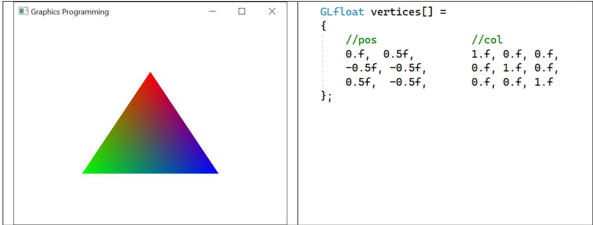

# Chapter 3  

# Graphics Programming  

# Learning Outcomes  

After studying this chapter, you are expected to be able to  

1. Name the graphics APIs that we will use in COMP3011 for graphics programming.   
2. Recognise the structure of a graphics program.   
3. Write the code of a simple vertex shader and simple fragment shader.   
4. Recognise GLFW code for creating a window and GL3W code for initialising OpenGL.   
5. Write a $\mathsf{C}/\mathsf{C}++$ array for specifying vertex attributes.   
6. Write OpenGL code to compile shaders.   
7. Write OpenGL code to create and setup two OpenGL objects for specifying how the vertex   
attributes are passed in to the vertex shader.   
8. Recognise that the vertex attribute index must match vertex shader input variable location.   
9. Recognise that for shader interfaces to match, the vertex shader output variables must have the   
same name and type as the fragment shader input variables.   
10. Write a simple render loop.   
11. Write GLFW deinitialization code.   
12. Write a callback function and enable it to debug OpenGL.   
13. Write code for debugging shader compilation.   
14. Write a callback function for handling user input.   
15. Write OpenGL code to set the value of a uniform in the application, and GLSL code to use the   
unfirm in the shader running on the GPU.  

# Introduction  

Refer again to the OpenGL rendering pipeline in Chapter 2. Some of the steps of the OpenGL rendering pipeline are implemented in hardware on the GPU and OpenGL provides an interface to that functionality.  

Graphics programming involves writing some code to run on the CPU and also writing some code which runs on the GPU.  

In COMP3011 we will use the following application programming interfaces (API).  

OpenGL that allows the graphics programmer to interface with graphics hardware.   
• GLSL that is the OpenGL shading language and is used for writing shaders which run on the GPU.   
• GL3W that is used to load OpenGL methods so that we can use them.   
• GLFW that is the OpenGL Utility Framework and is used for creating windows and handling user input.  

Please note that this chapter will be easily understood after you read it and completed Lab2 - Graphics Programming, and read some parts of it again.  

# Structure of a Graphics Program  

The following is the structure of a graphics program, written in C, and which runs on the CPU. This will  

  

These steps of the program are  

1. Make a window   
2. Initialise OpenGL   
3. Specify Vertices   
4. Compile Shaders   
5. Create buffers, Send to GPU   
6. Render Loop   
7. Deinitialisation  

I have omitted 3. Specify Vertices from the code sample on the previous page, since this can be many lines of code.  

# Simple Example Shaders  

During COMP3011 we will study vertex shaders and fragment shaders. During the shader compilation step, these shaders, written in GLSL code, are required.  

The simplest vertex shader is as follows  

  

Notice that there is an input variable, declared with the modifier in, of type vec4 called vPos, which is used to represent the vertex position. It is the programmer’s choice what to name this variable the same as during $\mathsf{C}/\mathsf{C}++$ programming, but it makes sense to prefix it with v to stand for vertex, and call it pos. This is copied to an OpenGL global variable gl_Position to be passed out of the shader. This vertex shader does not change the vertex position which is passed in, and is called a pass through shader.  

The simplest fragment shader is as follows  

1 #version 450 core   
2   
3 layout (location = 0) out vec4 fcolour;   
4   
5 void main()   
6   
fcolour = vec4(1.f, 0.f, 0.f, 1.0f);   
8  

Notice that there is an output variable, declared with the modifier out, of type vec4 called fColour, which is used to represent the fragment colour. As above, it makes sense to prefix it with f to stand for fragment and call it colour. This variable is set to the colour red on line 7, which means all fragments passed into this shader will have the colour red.  

Recall that a vector is just a list of numbers. The two variables above, vPos and fColour, are of type vec4 and you can see the value of each element of fColour.  

Both shaders specify that OpenGL version 4.5 is being used.  

# Shader input and output variables  

  
Figure 1 – Shader input and output variables  

In Figure 1 you can see a diagram representing vertex shader and fragment shaders drawn in blue, and the preceding and following steps in the rendering pipeline drawn in grey. See Ch7 - The Rendering Pipeline for more information.  

Shader input variables are passed into the shader from the previous stage in the rendering pipeline. In the case of the vertex shader, the input variable is passed from the application stage in the form of a vertex. The application is the $\mathsf{C}/\mathsf{C}++$ program that runs on the CPU. In the case of the fragment shader, the input variable is passed from the rasterisation stage in the form of a fragment.  

Shader output variables are passed out of the shader on to the next stage in the rendering pipeline. In the case of the vertex shader, the output variable is passed to the Vertex Post Processing stage in the form of a vertex. Vertex Post Processing is when triangles are assembled. In the case of the fragment shader, the output variable is passed to the colour buffer in the form of a colour. The colour buffer will then be displayed.  

# A More Detailed Look at the Code  

In this section we will take a detailed look at the Structure of a Graphics Program code line by line.  

# 1. Make a window  

OpenGL does not include an implementation for window creation or handling input. In COMP3011 we use GLFW for these tasks.  

The code for creating a window looks like this  

glfwInit(); $=$ glfwCreateWindow(640, 480, "A Triangle", NULL, NULL);   
glfwMakeContextCurrent(window);  

# The method  

int glfwInit (void)  

initializes GLFW and needs to be called before any other GLFW method is used.  

# The method  

GLFWwindow \* glfwCreateWindow (int width, int height,const char \* title, GLFWmonitor \* monitor, GLFWwindow \* share )  

creates and returns a window of width and height pixels, with the title as a title. Setting monitor to NULL will make a sized window rather than being full screen, and share should also be set to NULL.  

# The method  

void glfwMakeContextCurrent (GLFWwindow $\star$ window) makes the context of window the current one so that drawing happens to that window.  

# 2. Initialise OpenGL  

The code for initialising OpenGL looks like this  

gl3wInit();  

OpenGL methods need to be loaded before we can use them. This is accomplished using an OpenGL Extension Wrangler, or GLEW.  In COMP2011 we use the GL3W library, which only loads the core profile of OpenGL 3 and 4. See more here [1].  

# The method  

int gl3wInit(void) loads all OpenGL functions defined. GL3W provides access to the core OpenGL API.  

# 3. Specify Vertices  

Recall that a triangle is made of 3 vertices  

  
Vertex 2  

Each vertex has one or more vertex attributes, which may include a 3-dimensional position in the form of a vector, and could have a colour, and maybe more attributes. These attributes are interpolated by the rasteriser using the barycentric coordinates which were defined in Ch2 - Rendering.  

  
Figure 2- a coloured triangle with the vertex attributes array  

Vertex Specification occurs as a $\mathsf{C}/\mathsf{C}++$ array. As a simple example, Figure 2 shows a triangle made from the 3 vertices, each of which has a position and a colour.  

The screen space seen in Figure 2 is defined as $^{-1}$ to 1 left to right, and $^{-1}$ to 1 bottom to top, with (0,0) in the centre. So, you should be able to see that the first vertex is red in colour and half way from the centre of the screen to the top.  

As you read the code line-by-line, notice how each vertex is defined row-by-row, and for each vertex each attribute is defined one-after-the-next. Each vertex in this example is composed of 5 floats, with 2 floats for the position attribute and 3 floats for the colour attribute. Check the position and colour of each vertex in the render in Figure 2.  

# 4. Compile Shaders  

The overall code to compile the two shaders that we will use is as follows:  

  

The process of compiling a shader is as follows  

1. Use OpenGL to create a shader.   
2. Specify the source code. Each shader program is specified as a raw string.   
3. Use OpenGL to compile the shader.  

The method  

GLuint glCreateShader(GLenum shaderType)  

creates a shader and returns a handle for referencing it. In COMP3011 we will use shaderType set to GL_VERTEX_SHADER and GL_FRAGMENT_SHADER.  

# The function  

read_file()  

will be provided for you to use in COMP3011. The source code which defines a shader is read from file using the function. In the lab you can see the implementation of the function.  

# The function  

void glShaderSource(GLuint shader, GLsizei count, const GLchar \*\*string, const GLint \*length)  

sets the shader source as specified in string to the shader.  

The method  

void glCompileShader(GLuint shader)  

compiles the shader, just like a C program is compiled. OpenGL performs the compilation.  

The code for compiling a vertex shader can be seen highlighted by a red box in the code sample above and is repeated for compiling a fragment shader.  

The two shaders are then attached to a shader program which is linked before it can be used for rendering.  

The process of linking a shader program is as follows  

1. Use OpenGL to create a shader program   
2. Attach the shaders to the program   
3. Use OpenGL to link the program  

The method  

GLuint glCreateProgram()  

creates a shader program and returns a handle for referencing it. A shader program is used to store the shaders for the rendering process.  

# The method  

void glAttachShader(GLuint program, GLuint shader);   
attaches shader to program. Both shaders need to be attached to the shader program.  

# The method  

glLinkProgram(program)  

invokes OpgnGL to link the program argument, in the same way that gcc links a C program, which turns the attached shaders into executable code to run on the GPU.  

# 5. Create buffers, Send to GPU, Interface Matching  

OpenGL stores all of the data that is required during execution in buffer objects, which is way to interface with the GPU memory.  

The programmer needs to setup two OpenGL objects to specify how the vertex attributes array, as can be seen in Figure 2, is parsed and passed as input to the vertex shader.  

1. The vertex buffer object (VBO) contains a copy of the vertex attribute array.   
2. The vertex array object (VAO) contains all of the detail necessary for OpenGL to render, including a copy of the VBO just created and information about how the vertex buffer elements are to be interpreted by the vertex shader. glCreateBuffers(NUM_BUFFERs, Buffers);   
glNamedBufferStorage(Buffers[0], sizeof(vertices), vertices, 0):   
glGenVertexArrays(NUM_VAOS, VAOs);   
glBindVertexArray(VAos[0]):   
glBindBuffer(GL_ARRAY_BUFFER, Buffers[O]);   
glVertexAttribPointer(1, 3, GL_FLoAT, GL_FALSE, (5 \* sizeof(float)), (void\*)(2\*sizeof(float))); glEnableVertexAttribArray(1);  

# The method  

void glCreateBuffers( GLsizei n, GLuint \*buffers);   
creates n buffer objects, in VRAM on the GPU, and stores them in the buffers array.  

# The method  

void glNamedBufferStorage(GLuint buffer,GLsizeiptr size,const void\*data, GLbitfield flags);  

allocates size bytes in the buffer object's new data store, and copies data from RAM to the VRAM data store for initialization, and  flags can be set to NULL.  

# The method  

void glGenVertexArrays(GLsizei n, GLuint \*arrays);   
creates n VAOs and stores them in arrays array.  

The method  

void glBindVertexArray(GLuint array);   
binds the VAO array so that changes can be made to that VAO.  

# The method  

void glBindBuffer(GLenum target, GLuint buffer);   
binds buffer to target, which should be set to GL_ARRAY_BUFFER.  

Next each attribute in the vertex attribute array, as seen in Figure 2, needs to be described in the VAO.  

<html><body><table><tr><td>60</td><td>glCreateBuffersCNUM_BUFFERS,E Buffers);</td></tr><tr><td>61</td><td rowspan="2">glNamedBufferStorageCBuffers[o], sizeof(vertices), vertices, 0); glGenVertexArraysCNUM_VAOS，VAOs);</td></tr><tr><td>62</td></tr><tr><td>63</td><td>glBindVertexArray(VAOs[o]); glBindBufferCGL_ARRAY_BUFFER， Buffers[o]];</td></tr><tr><td>t79</td><td></td></tr><tr><td>65</td><td>glVertexAttribPointerCO，2，GL_FLOAT，GL_FALSE，（5 * sizeof(float))，(void*)o);</td></tr><tr><td>66</td><td>glEnableVertexAttribArray(o);</td></tr><tr><td></td><td rowspan="2">glVertexAttribPointer(1，3，GL_FLOAT，GL_FALSE，（5 *sizeof(float))，(void*)(2*sizeof(float)));</td></tr><tr><td>67</td><td rowspan="2"></td></tr><tr><td>68</td><td>glEnableVertexAttribArray(1);</td></tr></table></body></html>  

The way that the programmer specifies each vertex attribute in OpenGL code in the application is with paired calls of glVertexAttribPointer, glEnableVertexAttribArray. Notice how this pair of functions are called twice in the code above.  

# The method  

void glVertexAttribPointer( GLuint index, GLint size, GLenum type,GLboolean normalized, GLsizei stride, const void \*offset)  

specifies that the index attribute has size number of components of the specified type, where each vertex is made from stride bytes, and offset is the index of the first element of this attribute after the start of particular vertex.  

# The method  

void glEnableVertexAttribArray( GLuint index) enables index vertex attribute.  

Refer again to the vertex specification in Figure 2.  

Line 65 is specifying that the first attribute $(\mathrm{index~=~0})$ ) is composed of 2 GL_FLOATs, where each vertex is composed of 5 floats, and the first element of this attribute has an offset of 0. This is the position vertex attribute.  

Line 67 is specifying that the second attribute $\left({\mathrm{index~}}=1\right)$ ) is composed of 3 GL_FLOATs, where each vertex is composed of 5 floats, and the first element of this attribute has an offset of 2. This is the colour vertex attribute.  

Recall from Figure 2 that vertices are specified as a $\mathsf{C}/\mathsf{C}++$ array of float type, which will be in RAM on the host computer. The code on line 61 glNamedBufferStorage()allocates enough VRAM on the GPU, and copies the values from RAM to VRAM GPU memory. The reason why we use $\mathsf{C}/\mathsf{C}++$ for graphics programming is so that we can access contiguous memory directly. This means that the vertices are stored on both the CPU and GPU memory storage, in respective sections of contiguous memory, and we use glVertexAttribPointer to specify how the vertex attributes are organised in this memory.  

This vertex attribute data from Figure 2, is then organised in VRAM and RAM memory as follows,  

  

This way of specifying each attribute in the vertex array using OpenGL code is carried out in unison with specifying the vertex shader input variables in GLSL code. The vertex shader input variables are specified in the vertex shader as follows.  

  

The above example specifies that the first input variable (location $\begin{array}{r l}{\mathbf{\eta}}&{{}=\mathbf{\eta}}\ {\mathbf{\eta}}&{{}=\mathbf{\eta}}\end{array}\begin{array}{r l}\end{array}$ ) of the vertex shader is a vec4 and represents the position of the vertex (vPos). Then the second input variable (location $=$ 1) of the vertex shader is a vec3 and represents the colour of the vertex (vCol).  

The value used for index when using glVertexAttribPointer() and glEnableVertexAttribArray() needs to match the location in the vertex shader. Notice how (index $\begin{array}{r l}{\mathbf{\eta}}&{{}=\mathbf{\eta}}\ {\mathbf{\eta}}&{{}=\mathbf{\eta}}\end{array}\begin{array}{r l}\end{array}$ ) and (location $\begin{array}{r l}{\mathbf{\eta}}&{{}=\mathbf{\eta}}\ {\mathbf{\eta}}&{{}=\mathbf{\eta}}\end{array}\begin{array}{r l}\end{array}$ ) for the position of the vertex, and (index $\L=\L\perp$ ) and (location $\L=\L\perp$ ) for the colour of the vertex.  

It doesn’t matter that we only specify 2 floats for the vertex position when we use glVertexAttribPointer and then use a vec4 for the corresponding vPos input variable in the vertex shader. OpenGL will fill in the missing 2 floats with a 1.0 value when it passes them into the vertex shader.  

The output of a vertex shader must match the input of the fragment shader, in terms of the interface. Interface matching is checked when the shader program is linked. In order to match, the variables must have the same name and type.  

In the example above we output the vertex colour from the vertex shader. This must match the input to the fragment shader. Notice above line 6 of the vertex shader the name and type matches line 5 of the fragment shader below.  

This input variable can then be used as the colour of the fragment as seen below.  

  

# 6. Render loop  

A simple render loop looks like this  

while (!glfwWindowShouldClose(window)) static const GLfloat bgd[] $=$ { 1.f, 1.f, 1.f, 1.f }; glClearBufferfv(GL_COLOR, 0, bgd); glUseProgram(program) ; glBindVertexArray(VAOs[o]); glDrawArrays(GL_TRIANGLES, 0, 3); glfwSwapBuffers(window) ; glfwPollEventsC);  

The program needs to continuously and repeatedly render to the screen so that the graphics can be animated, and this is achieved using a render loop as follows  

  

The method  

int glfwWindowShouldClose (GLFWwindow \* window)  

returns the close flag of window so that the render loop can stop executing when the user has closed the window. This means that the render loop will loop repeatedly while the window is open.  

# The method  

void glClearBufferfv( GLenum buffer,  GLint drawbuffer, const GLfloat \* value)  

clears buffer colour buffer to the colour stored in value. The paramter drawbuffer can be set to 0.  

# The method  

void glUseProgram(GLuint program);  

sets the linked shader program program, whose shader binaries are to be used for rendering, to be active so that OpenGL will use those shaders for rendering.  

# The method  

void glBindVertexArray(GLuint array);   
binds the VAO array so that the vertices will be used for rendering.  

# The method  

void glDrawArrays(GLenum mode,GLint first,GLsizei count);  

draws the triangles. This is achieved using mode set to GL_TRIANGLES, starting from first index, and count is the number of vertices to be drawn. This causes the GPU to read vertices from the buffer in the bound VAO, and to begin rendering. It is important to note that the GPU is not synchronized with the CPU. Even after glDrawArrays() has been executed, there is no guarantee that the GPU will have finished drawing to the colour buffer, or even started the rendering process.  

Doubling buffering is used in computer graphics to improve the image quality. In this process a first buffer, A, is used for displaying the colour of the pixels whilst a second buffer, B, is being written to by OpenGL. After the frame has been displayed, the buffers are swapped, so that the new colours in B are displayed and the next frame is prepared by OpenGL in the other buffer A.  

# The method  

void glfwSwapBuffers (GLFWwindow \* window)  

swaps the front and back buffers used in double buffering.  

# The method  

void glfwPollEvents (void)  

processes input events.  

# 7. Deinitialisation  

The deinitialization code looks like this  

glfwDestroyWindow(window) ;   
glfwTerminate(); The method   
void glfwDestroyWindow ( GLFWwindow \*  window) destroys window. The method   
void glfwTerminate (void) deinitialises GLFW.  

# Debugging OpenGL  

See more information in Appendix G of [2].  

Debugging of OpenGL code can be accomplished using a callback function which will be called when an error occurs.  

The programmer defines a callback function which is executed whenever a certain event occurs, in this case when an error occurs.  

# We need to define a callback  

f $==$ {  

The code in the callback above first checks if the message is an error and then prints the actual message produced by OpenGL.  

# The callback function prototype is  

void (APIENTRY \*DEBUGPROC)(GLenum source,GLenum type,GLuint id,GLenum severity, GLsizei length, const GLchar \*message, const void \*userParam);  

where type can be checked for GL_DEBUG_TYPE_ERROR,  severity is low medium or high, message is an error message string which can be printed.  We don’t need source , id , length and userParam. As a graphics programmer you can define your callback to do anything, so long as you make sure it has the prototype specified.  

The code for using debugging in OpenGL looks like glDebugMessageCallback(DebguMessageCallback, 0);  

# The method  

glEnable(GL_DEBUG_OUTPUT);  

enables debugging so that debug messages are produced by OpenGL.  

# The method  

void glDebugMessageCallback(DEBUGPROC callback, const void \*userParam);  

registers debug callback which we set to be the debug callback we have defined, and userParam is 0.  

# Debugging Shader Compilation  

After compiling the vertex and fragment shader, and also linking the program, we need to check for errors.  

The code for debugging shader compilation looks like  

  

# The method  

void glGetShaderiv(GLuint shader,GLenum pname, GLint \*params); using pname set to GL_COMPILE_STATUS checks for compilation errors in shader, and stores the result in params.  

# The method  

void glGetShaderInfoLog(GLuint shader,GLsizei maxLength,GLsizei\*length, GLchar \*infoLog);  

queries the information log of shader, where maxLength is the size of the character buffer, length can be NULL, and infoLog specifies an array of characters that is used to return the information log.  

Checking for shader link is similar.  

The method  

void glGetProgramiv( GLuint program,GLenum pname,GLint \*params);  

with  pname set to GL_LINK_STATUS, checks for link errors in program, and stores the result in params.  

# The method  

void glGetProgramInfoLog(GLuint program,GLsizei maxLength,GLsizei\*length,GLchar \*infoLog);  

queries the log of program, where maxLength is the size of the character buffer, length can be NULL, and infoLog specifies an array of characters that is used to return the information log.  

# Handling User Input  

Handling user input is achieved by using a key input function and a resize callback function.  

# Handling key presses is achieved using  

{ $==$ $==$ GLFW_PRESS) y_offset $+=~\Theta,\Theta1\bar{+}$ $==$ y_offset $\mathrm{~\boldmath~\omega~}=~\Theta.\Theta1\mathrm{{f}}$ $==$ x_offset $+=~\Theta.\Theta1\bar{\sf}+\mathrm{\Delta}$ $==$ x_offset $\mathrm{~\boldmath~\omega~}=~\Theta.\Theta1\mathrm{{f}}$  

In this example, the user can close the application window by pressing the escape key, and interact using the arrow keys.  

# The method  

int glfwGetKey (GLFWwindow \*window, int key) returns the state of key for the specified window.  

# The method  

void glfwSetWindowShouldClose (GLFWwindow \*window, int value) sets the close flag of the specified window.  

A list of keys can be found here https://www.glfw.org/docs/3.0/group__keys.html  

The key press function needs to be called in the render loop after polling events  

  

Handling the user resizing the window is achieved by specifying a resize callback  

Jvoid SizeCallback(GLFWwindow\* window, int w, int h)   
3 glViewport(o, 0, w, h);  

glViewport() will make more sense after you have read the chapter on the rendering pipeline.  

# The callback prototype is  

void(\* GLFWwindowsizefun) (GLFWwindow \*, int w, int h)  

where window is the window that the user resized, w is the new width and h is the new height of the window.  

The callback is set after creating the window  

  

# The method  

GLFWwindowsizefun glfwSetWindowSizeCallback(GLFWwindow \*window, GLFWwindowsizefun  cbfun)  

sets the specified callback function cbfun to the specified window.  

# Uniforms  

A uniform is a variable which can have its value set by the application program before the GLSL program is executed, and its value will not change for all executions of the shaders in the program.  

Uniforms are declared with the uniform qualifier.  

The way that the application program changes the value of the uniform is first to find the location of the uniform and then to set the value, like this  

while (!glfwWindowShouldClose(window)) static const GLfloat bgd[] $=$ {1.f, 1.f, 1.f, 1.f }; glClearBufferfv(GL_COLOR, O, bgd); glUseProgram(program) ; glUniformlfCglGetUniformLocation(program, "x_offset"), x-offset); glUniformlf(glGetUniformLocation(program, "y_offset"), y_offset); glBindVertexArray(VAOs[0]); glDrawArrays(GL_TRIANGLES, ①, 3); glfwSwapBuffers(window) ; glfwPolLEvents();  

The method  

GLint glGetUniformLocation(GLuint program,const GLchar \*name);   
queries the location of name uniform variable in program.  

# The method  

void glUniform1f(GLint location,GLfloat v0);   
modifies the uniform variable at location to v0 new value.  

There are many different uniform types see more https://registry.khronos.org/OpenGLRefpages/gl4/html/glUniform.xhtml  

This uniform needs to be declared and used in any of the shaders in the active program, as shown below.  

#version 450 core  

layout (location $\begin{array}{r l}{\mathbf{\Phi}}&{{}=\mathbf{\Phi}\Theta.}\end{array}$ ) in vec4 vPos;   
layout (location $=1)$ ） in vec3 vCol;   
out vec3 col; uniform float x_offset;   
uniform float y_offset;  

void main() gl_Position $=$ vecL CvPos.x+x_offset, vPos.y+y_offsei 0.f, 1.f); col $=$ vCol;  

# Chapter Index  

API, 2   
callback function, 19   
compiling a shader, 10   
Debugging of OpenGL code, 19   
debugging shader compilation, 21   
GL3W, 2   
GLFW, 2   
Handling user input, 23   
Interface matching, 15   
OpenGL, 2   
pass through shader, 5   
render loop, 16   
Shader input variables, 6   
Shader output variables, 6   
shader program, 11   
simplest fragment shader, 5   
simplest vertex shader, 5   
structure of a graphics program, 3   
uniform, 25   
VAO, 12   
VBO, 12   
vertex attributes, 9   
Vertex Specification, 9   
window creation, 7  

# Bibliography  

[1] khronos, "OpenGL Loading Library," [Online]. Available: https://www.khronos.org/opengl/wiki/OpenGL_Loading_Library. [2] J. Kessenich, G. Sellers and D. Shreiner, The OpenGL Programming Guide, 9 ed., 2016.  