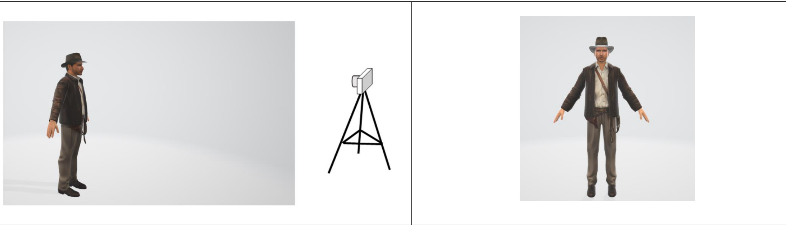

# Chapter 6 Spaces  

# Learning Outcomes  

After studying this chapter, you are expected to be able to  

1. Recognise that 3D rendering involves a camera.   
2. Visualise a vertex in 3D space being transformed through 6 spaces on its way to the 2D display.   
3. Define model, view and projection matrices, perspective division, and viewport transformation, which are used to transform between the 6 spaces.   
4. Model a cube in model space using 8 corner positions and visualise model space.   
5. Specify a position in world space, construct a model matrix to transform the cube from model space to world space, and visualise world space.   
6. Specify the position of a camera in world space, construct a view matrix to transform the cube from world space to view space, and visualise view spac   
7. Explain why view matrix transformations are inverted.   
8. Specify a view frustum to define what will be rendered to the display with visible perspective.   
9. Sketch the position of a cube in view space within a frustum, construct a projection matrix, and transform the cube from view space to clip space.   
10. Use perspective division to transform from clip space to normalised device coordinate NDC space.   
11. Visualise normalised device coordinate space and how it relates to screen space.   
12. Construct a viewport transformation to transform the cube from NDC space to screen space.   
13. Visualise how triangles can be constructed from vertices in screen space, to be rasterised.  

# Projecting from 3D to 2D  

3D rendering is the process of drawing 3D images on the 2D computer display. 3D rendering requires vertices, a camera with a location and direction, and a display to draw triangles made from the vertices which are visible in the camera. This can be seen in Figure 1.  

  
Figure 1 – Left: A model and camera are specified in 3D. Right: The visible model is displayed in 2D  

3D space has 3 dimensions, $\times,\lor,$ and z. A position in 3D space is specified with a cartesian coordinate ${\sf p}=({\sf x},{\sf y},z)$ , which we represent using a vector in ${\mathbb{R}}^{3}$ .   
A computer display has 2 dimensions, x and y, specified with a cartesian coordinate ${\boldsymbol{\mathsf{p}}}=({\boldsymbol{\mathsf{x}}},{\boldsymbol{\mathsf{y}}})$ , which we represent using a vector in $\mathbb{R}^{2}$ .   
Therefore, an important part of rendering is projection from 3D to 2D.  

# Photographer analogy  

In 3D rendering it is good to think of the photographer analogy.  

When a photographer wants to take a photograph of an object, the photographer moves the object to a position in the room where the lighting is good and moves the camera to a position which captures the object from a good angle. This is also the case in 3D graphics.  

It is important to understand that an object and a camera relate to each other as opposites:  

1. If the photographer moves the camera backwards away from the object, that is moves the camera to the right in Figure 1, this is the same as moving the object in the opposite direction, away from the camera and to the left in Figure 1. Either way, the result is that the object will appear smaller in the final render. 2. If the photographer rotates the camera anti-clockwise from landscape to portrait, this is the same as rotating the object in the opposite direction, clockwise.  

# Spaces  

In order to project from 3D to 2D, vertices are transformed through several spaces.  

  
Figure 2 – 6 spaces used in rendering.  

There are 6 spaces as shown in Figure 2. From left to right, the spaces are:  

1. Model Space, in 3D, is relative to an individual model which is made up of vertices. In Figure 1 you can imagine thousands of vertices positioned relative to the centre of the object, which form a mesh of triangles around the object surface. In model space there is no information about where an object is relative to anythin in the world, there is only information about the relative positions of the vertices which make up the object. In this way 3D objects are constructed from vertices.   
2. World Space, in 3D, is relative to a larger coordinate system. In Figure 1 you can imagine the centre of the world being in between the object and camera. Vertices are positioned in model space, and then afterwards they are all moved to their appropriate places in world space. In this way 3D objects have a world position.   
3. View Space, in 3D, has all vertices from the perspective of the viewer. In Figure 1 you can imagine the centre of the view being at the location of the camera. Vertices are positioned in model space, moved to world space, and then moved to a position relative to the viewer. In this way 3D models have a position relative to the camera.   
4. Clip Space, in 2D, is an intermediate space after vertices have been projected to the screen.   
5. Normalised Device Coordinate (NDC) Space, in 2D, is almost identical to screen space. Vertices inside NDC Space will be rendered at those positions.   
6. Screen Space, in 2D, maps directly to the pixels on the screen. At this point vertices can be used to construct triangles, which are rasterized and the appropriate pixels coloured accordingly.  

# Transformations between Spaces  

We transform vertices between the 6 spaces, using transformations  

  
Figure 3 – Transformations between spaces.   
Figure 3 shows the transformations, which from left to right are:  

1. Model transformation of vertices from model space to world space. This is achieved using a model matrix.   
2. View transformation of vertices from world space to view space. This is achieved using a view matrix.   
3. Projection transformation of vertices from view space to clip space. This is achieved using a projection matrix.   
4. Perspective Division of vertices from clip space to NDC space. This is achieved by dividing each component by its homogeneous w component.   
5. Viewport Transformation of normalized coordinates to screen pixel coordinates.  

# Model Space  

Model space is relative to an individual model. Usually, the origin of the model space is at the centre of the model.  

  
Figure 4 – Model Space, a figure of a cube, and a vertex $v1_{m o d e l}$ labeled.  

a model of a cube, with the origin of the model space at the cube’s centre point. The top-left-back vertex in model space, $v1_{m o d e l},$ , is labelled in the figure.  

# World Space  

orld space is used for positioning all the models relative to each other and a camera. The origin of world space can be anywhere.  

  
Figure 5 – World Space  

In Figure 5, two cubes are shown at their positions in world space, where the origin of each model space is at that model’s position. A camera is shown at its position which will be used in the next section.  

Translation, scale, and rotation of each model to world space can achieved using a model matrix. A model matrix is constructed for each of the models that are in the scene by combining rotation, scale, and translation matrices. When the model matrix is applied to the model, the model matrix transforms all the vertices specifying that model.  

In the figure the green cube is at position (5, 0, 7) and is not rotated or scaled, so the model matrix for the green cube is  

$$
M={\left(\begin{array}{l l l l}{1}&{0}&{0}&{5}\ {0}&{1}&{0}&{0}\ {0}&{0}&{1}&{7}\ {0}&{0}&{0}&{1}\end{array}\right)}
$$  

As an example, the top-left-back vertex $v1_{m o d e l}$ in Figure 4 is multiplied by the model matrix M. Vertex $v1_{m o d e l}$ including the homogeneous coordinate is  

$$
v1_{m o d e l}=\binom{-1}{1}
$$  

After the transformation of the vertex from model space to world space the top-left-back vertex changes to  

$$
v1_{m o d e l}={\left(\begin{array}{l l l l}{1}&{0}&{0}&{5}\ {0}&{1}&{0}&{0}\ {0}&{0}&{1}&{7}\ {0}&{0}&{0}&{1}\end{array}\right)}\times{\left(\begin{array}{l}{-1}\ {1}\ {-1}\ {1}\end{array}\right)}=\left(-1{\left(\begin{array}{l}{1}\ {0}\ {0}\ {0}\end{array}\right)}+1{\left(\begin{array}{l}{0}\ {1}\ {0}\ {0}\end{array}\right)}+-1{\left(\begin{array}{l}{0}\ {0}\ {1}\ {0}\end{array}\right)}+1{\left(\begin{array}{l}{5}\ {0}\ {7}\ {1}\end{array}\right)}\right)=\left({\left(\begin{array}{l}{-1}\ {0}\ {0}\ {0}\end{array}\right)}+1{\left(\begin{array}{l}{0}\ {0}\ {1}\end{array}\right)}\right)
$$  

The new position of the top-left-back vertex in world space $v1_{w o r l d}$ is then (4,1,6) as shown in Figure 5.  

# View Space  

The view space has each vertex of each object at a position from the point of view of the camera. The origin of the view space is the position of the camera, and the camera is pointing towards the negative Z axis.  

  
Figure 6 – View Space  

igure 6 shows the two cubes in view space, with the camera at the origin pointing down the -Z axis, and the camera is also shown at (0, 0, 0).  

The translation and rotation of each object from world space to view space is achieved by using a view matrix. A view matrix is applied to all vertices specifying each model in the scene.  

In Figure 5 the camera is at position (5, 5, 5) and is rotated clockwise, $\mathtt{-90^{\circ}}$ , around the x-axis. Check Figure 5, and use your right hand to verify the translation and rotation of the camera in the figure.  

It is important to understand that there is no camera in rendering. There are only vertices. Transformation matrix operations are applied to vertices in the vertex shader.   
we want to move the camera then we actually achieve that by moving the vertices in the opposite way. Refer again to the photographer analogy above.  

tion needs to be negated because moving the camera forwards is the same as moving all the models backwards. The view translation matrix therefore is  

$$
T={\left(\begin{array}{l l l l}{1}&{0}&{0}&{-5}\ {0}&{1}&{0}&{-5}\ {0}&{0}&{1}&{-5}\ {0}&{0}&{0}&{1}\end{array}\right)}
$$  

Rotation also needs to be negated because rotating the camera clockwise is the same as rotating all the models anticlockwise. The view rotation matrix is therefore calculated using $\theta=90$  

$$
R x(\theta)={\left(\begin{array}{l l l l}{1}&{0}&{0}&{0}\ {0}&{\cos\theta}&{-\sin\theta}&{0}\ {0}&{\sin\theta}&{\cos\theta}&{0}\ {0}&{0}&{0}&{1}\end{array}\right)}={\left(\begin{array}{l l l l}{1}&{0}&{0}&{0}\ {0}&{0}&{-1}&{0}\ {0}&{1}&{0}&{0}\ {0}&{0}&{0}&{1}\end{array}\right)}
$$  

hen we transform the top-left-back vertex in world space $v1_{w o r l d}$ (4,1,6) as shown in Figure 5, which including the homogeneous coordinate i  

$$
v1_{w o r l d}=\left(\begin{array}{l}{4}\ {1}\ {6}\ {1}\end{array}\right)
$$  

The vertex is first translated  

$$
{\begin{array}{r l}{0}&{0}&{-5}\ {1}&{0}&{-5}\ {0}&{1}&{-5}\ {0}&{0}&{1}\end{array}}\times{\left(\begin{array}{l}{4}\ {1}\ {6}\ {1}\end{array}\right)}=\left(4{\left(\begin{array}{l}{1}\ {0}\ {0}\ {0}\end{array}\right)}+1{\left(\begin{array}{l}{0}\ {1}\ {0}\ {0}\end{array}\right)}+6{\left(\begin{array}{l}{0}\ {0}\ {1}\ {0}\end{array}\right)}+1{\left(\begin{array}{l}{-5}\ {-5}\ {-5}\ {1}\end{array}\right)}\right)=\left({\left(\begin{array}{l}{4}\ {0}\ {0}\ {0}\end{array}\right)}+{\left(\begin{array}{l}{0}\ {1}\ {0}\ {0}\end{array}\right)}+{\left(\begin{array}{l}{0}\ {0}\ {6}\ {0}\end{array}\right)}+{\left(\begin{array}{l}{0}\ {0}\ {0}\end{array}\right)}+\left({\begin{array}{l}{0}\ {1}\ {0}\ {0}\end{array}\right)}\right)
$$  

The vertex is then rotated  

$$
)\times u={\left(\begin{array}{l l l l}{1}&{0}&{0}&{0}\ {0}&{0}&{-1}&{0}\ {0}&{1}&{0}&{0}\ {0}&{0}&{0}&{1}\end{array}\right)}\times{\left(\begin{array}{l}{-1}\ {-4}\ {1}\ {1}\end{array}\right)}=\left(-1{\left(\begin{array}{l}{1}\ {0}\ {0}\ {0}\end{array}\right)}+-4{\left(\begin{array}{l}{0}\ {0}\ {1}\ {0}\end{array}\right)}+1{\left(\begin{array}{l}{0}\ {-1}\ {0}\ {0}\end{array}\right)}+1{\left(\begin{array}{l}{0}\ {0}\ {0}\ {1}\end{array}\right)}\right)=\left({\left(\begin{array}{l}{-1}\ {0}\ {0}\ {0}\end{array}\right)}\right)
$$  

the transformation of the top-left-back vertex $v1_{w o r l d}$ from world space to $v1_{v i e w}$ in view space, the new position $v1_{v i e w}$ is (-1,-1,-4) as shown in Figure 6.  

  
Figure 7 – View Space & Frustum  

-f = -6  

Figure 7 shows the two cubes in the view space, with the camera at the origin pointing down the -Z axis, and a frustum. Everything outside the frustum will not be rendered. Notice that the frustum has a smaller face near to the camera and larger face further from the camera. The frustum will be transformed to a cube, and during that process perspective will be added to all of the contents of the frustum. A frustum is defined using left (l), right (r), top (t), bottom (b), near (n) and far (f) values.  

# Clip space  

The transformation from view space to clip space is achieved by using a projection matrix. The general projection matrix is  

$$
P=\left(\begin{array}{c c c c}{{\frac{n}{r}}}&{{0}}&{{0}}&{{0}}\ {{0}}&{{\frac{n}{t}}}&{{0}}&{{0}}\ {{0}}&{{0}}&{{\frac{-(f+n)}{f-n}}}&{{\frac{-2(f*n)}{f-n}}}\ {{0}}&{{0}}&{{-1}}&{{0}}\end{array}\right)
$$  

The projection matrix using the parameters defining the frustum in Figure 7 is  

$$
P=\left({\begin{array}{c c c c}{{\displaystyle{\frac{2}{1}}}}&{{0}}&{{0}}&{{0}}\ {{0}}&{{\displaystyle{\frac{2}{1}}}}&{{0}}&{{0}}\ {{0}}&{{0}}&{{\displaystyle{\frac{-(6+2)}{6-2}}}}&{{\displaystyle{\frac{-2(6*2)}{6-2}}}}\ {{0}}&{{0}}&{{\displaystyle{-1}}}&{{0}}\end{array}}\right)=\left({\begin{array}{c c c c}{{2}}&{{0}}&{{0}}&{{0}}\ {{0}}&{{2}}&{{0}}&{{0}}\ {{0}}&{{0}}&{{-2}}&{{-6}}\ {{0}}&{{0}}&{{-1}}&{{0}}\end{array}}\right)
$$  

The top-left-back vertex in view space $v1_{v i e w}(-1,-1,-4)$ can be projected to clip space by using the projection matrix.  

$$
{\scriptstyle\mathrm{z}_{L I P}}=\left(\begin{array}{l l l l}{2}&{0}&{0}&{0}\ {0}&{2}&{0}&{0}\ {0}&{0}&{-2}&{-6}\ {0}&{0}&{-1}&{0}\end{array}\right)\times\left(\begin{array}{l}{-1}\ {-1}\ {-4}\ {1}\end{array}\right)=\left(-1\left(\begin{array}{l}{2}\ {0}\ {0}\ {0}\end{array}\right)+-1\left(\begin{array}{l}{0}\ {2}\ {0}\ {0}\end{array}\right)+-4\left(\begin{array}{l}{0}\ {0}\ {-2}\ {-1}\end{array}\right)+1\left(\begin{array}{l}{0}\ {0}\ {-6}\ {0}\end{array}\right)\right)=\left(\left(\begin{array}{l}{0}\ {0}\ {0}\ {0}\end{array}\right)+\left(\begin{array}{l}{0}\ {-1}\ {0}\ {0}\end{array}\right)+\left(\begin{array}{l}{0}\ {0}\ {-2}\ {0}\end{array}\right)\right)
$$  

# NDC Space  

The transformation from clip space to NDC space is achieved by perspective division.  

$$
N D C\left(\begin{array}{l}{\frac{C L I P_{x}}{C L I P_{w}}}\ {\frac{C L I P_{y}}{C L I P_{w}}}\ {\frac{C L I P_{z}}{C L I P_{w}}}\ {\frac{C L I P_{w}}{C L I P_{w}}}\ {\frac{C L I P_{w}}{C L I P_{w}}}\end{array}\right)
$$  

For example the vertex $v1_{C L I P}$ in clip space, (-2, -2, 2, 4), is transformed from clip space to NDC space  

$$
v1_{N D C}=\left(\begin{array}{c}{{-\frac{2}{4}}}\ {{-\frac{2}{4}}}\ {{\frac{2}{4}}}\ {{\frac{4}{4}}}\end{array}\right)=\left(\begin{array}{c}{{-0.5}}\ {{-0.5}}\ {{0.5}}\ {{1}}\end{array}\right)
$$  

  
Figure 8 – NDC Space  

-1, -1, -1  

Figure 8 shows the green and red cubes in NDC space. The origin of NDC space is at the centre of the space. It has a normalized range of values, $^{-1}$ to 1, in x y and z dimensions. The frustum from Figure 7 has been transformed to a NDC cube, which contains what will be rendered. Notice that the red and green cubes now have perspective, and the far faces of the cubes are smaller than the near faces. The top-left-back vertex in NDC space $v1_{N D C}=(-0.5,-0.5,0.5)$ is shown in Figure 8.  

# Screen Space  

Screen space corresponds to the pixels on the screen. The vertices in NDC space are transformed to screen space using the viewport transformation. Viewport transformation uses the following formula, where 𝑤𝑖𝑑𝑡ℎ and ℎ𝑒𝑖𝑔ℎ𝑡 are the dimensions in pixels of the display  

$$
S C R E E N=\binom{(N D C x+1.0)*(w i d t h/2)}{(N D C y+1.0)*(h e i g h t/2)}
$$  

The display in Figure 9 is 300 pixels wide and 200 pixels high.  

Then vertex $v1_{N D C}=(-0.5,-0.5,0.5)$ is transformed to screen space as follows $v1_{s c r e e n}=\binom{(-0.5+1.0)*(300/2)}{(-0.5+1.0)*(200/2)}=\binom{75}{50}$  

  
Figure 9 – Screen Space  

0, 0  

Figure 9 shows $v1_{s c r e e n}$ labelled with the green and red cubes drawn with perspective, in screen space. Notice that the bottom of the green cube and right of the red cube are not drawn because they are off the screen.   
Vertices in screen space are then used to construct triangles, and rasterisation is performed on the triangles in screen space.  

# Chapter Index  

Clip Space, 4   
Model Space, 4   
Model transformation, 5   
NDC Space, 4   
Perspective Division, 5   
projection, 2   
Projection transformation, 5   
Screen Space, 4   
View Space, 4   
View transformation, 5   
Viewport Transformation, 5   
World Space, 4  