# Chapter 7  

# The Rendering Pipeline  

# Learning Outcomes  

After studying this chapter, you are expected to be able to  

1. Describe the Rendering Pipeline, including all its stages.   
2. Recall from previous chapters vertex specification, vertex shading, rasterisation and fragment shading, and combine these stages with the stages of the rendering   
pipeline introduced in this chapter, vertex post-processing and merging.   
1. Describe clipping, which happens in the Vertex Post-processing stage.   
3. Describe merging, where fragment visibility is resolved using the z-buffer, also known as depth buffer.  

# Rendering pipeline  

Recall the OpenGL Rendering Pipeline from Chapter 2. Now we have learned enough about graphics to fill in important stages in the OpenGL Rendering Pipeline in order to describe the general Rendering Pipeline. Once we know the Rendering Pipeline, we can understand how vertices eventually end up as coloured pixels on the display.  

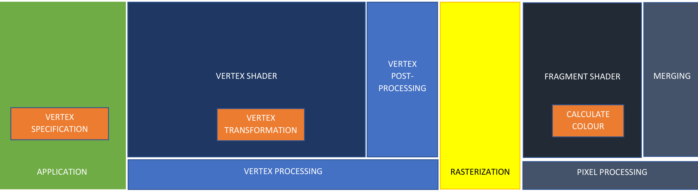  
Figure 1 - The Rendering Pipeline.  

The five stages of the OpenGL Rendering Pipeline can be expanded to make the Rendering Pipeline as shown in Figure 1.  

he four main stages of the Rendering Pipeline can be seen in Figure 1 coloured in green, blue, yellow, and black.  

1. The application stage is the software that runs on the CPU. This is a program written in $\mathsf{C}/\mathsf{C}++$ with a main() function. There is code in the application stage, e.g. glNamedBufferStorage(),which copies vertices to the GPU memory for the next stage, vertex processing. The application stage is where user input is handled, and object and camara positions are calculated using simulation code.   
2. The Vertex Processing stage is responsible for processing individual vertices. In this stage vertex positions are transformed from model space to world space and view space, and projected to clip coordinates, as described in Chapter 6, in the vertex shader. In this stage triangles are clipped if they are not completely visible and perspective divide transforms vertex positions into normalised device coordinates. The x and y components are transformed to screen coordinates and the z component is stored in a depth buffer, and these 3 values are passed to the rasterisation stage.   
3. The rasterisation stage is responsible for calculating all the pixels that are inside the triangles which are being rendered. Any pixel inside a triangle is a fragment. The vertex attributes e.g. position or colour, are interpolated to make fragment attributes. All fragments are sent to the pixel processing stage. You will not have seen any implementation of OpenGL’s rasteriser because it is implemented in dedicated hardware on the GPU.   
4. The pixel processing stage is responsible for processing individual fragments. The fragment shader computes a colour which is then merged with the colour buffer. Merging calculates which fragments are hidden behind other fragments and only keeps the colour for the visible fragment.  

The stages of the rendering pipeline are described in more detail in the following sections.  

# Application Stage  

Vertex specification happens in the application stage which is running in software on the CPU.  

Recall from Chapter 2 that during vertex specification the programmer creates an array of vertices for OpenGL to render and provides information about how the vertices are passed as input variables to the vertex shader.  

At this point in the pipeline, vertices, a camera and object positions have been specified, as shown in Figure 2.  

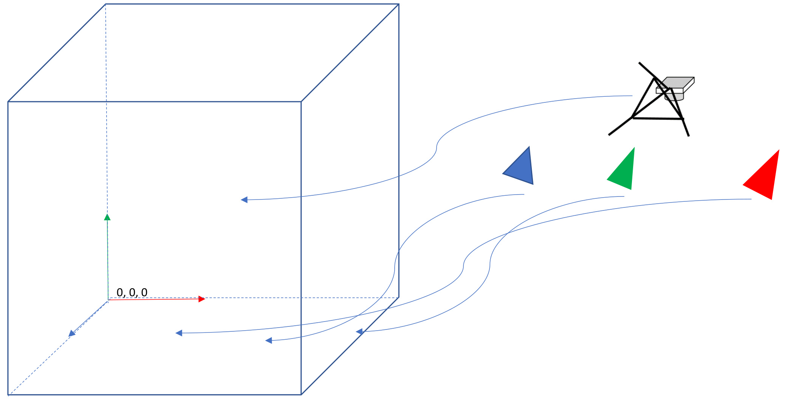  
Figure 2 – vertices, camera and object positions have been specified  

# Vertex Processing Stage  

The Vertex Processing stage consists of the following substages:  

1. Vertex Shader   
2. Vertex Post-processing  

# Vertex Shader  

In the vertex shader vertices are transformed from model space to world space using the model matrix, as shown in Figure 3.  

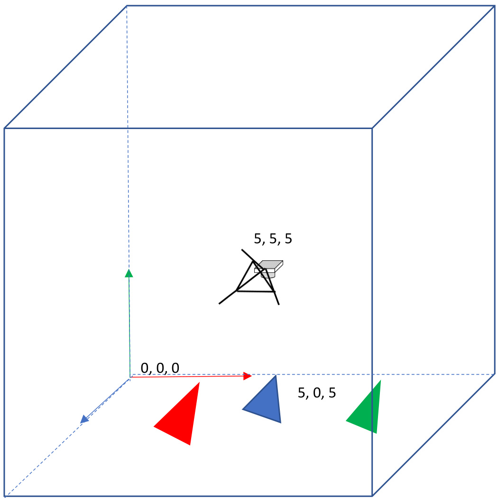  
Figure 3 - vertices and camera shown in world space  

Then vertices are transformed to view space using view matrix.  

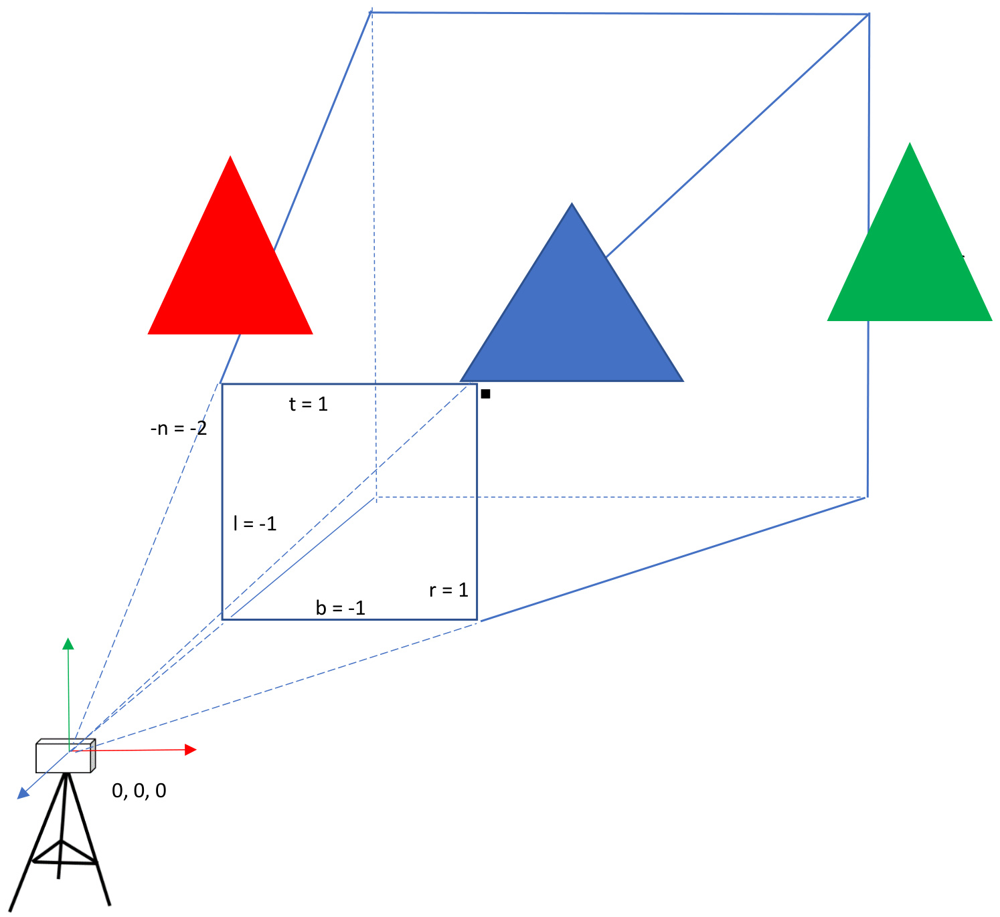  
Figure 4 – View space with view frustum  

Finally vertices are transformed to clip space using the projection matrix.  

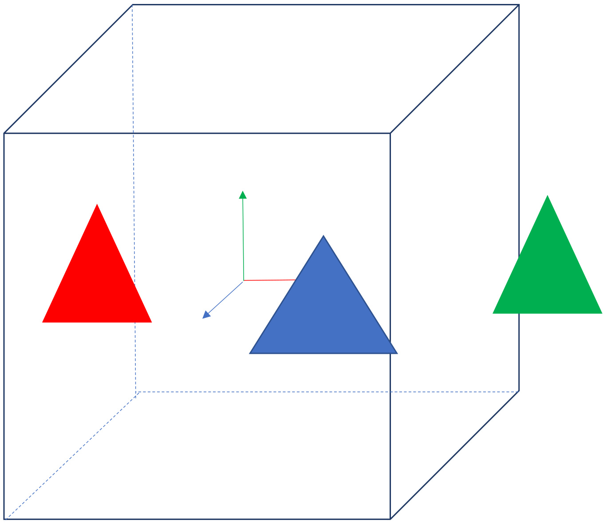  
Figure 5 – View volume with vertices in in Clip space  

Vertices are now in a cube called the view volume, which represents what is visible to the camera. Although the display is 2 dimensional, there is a $3^{\mathsf{r d}}$ dimension, the zdimension, which is used in depth testing, described below.  

# Vertex Post-Processing  

we can introduce a new stage of the rendering pipeline. The vertex Post processing stage happens immediately after the vertex shader has been executed.  

Vertex Post-processing includes:  

2. Primitive Assembly.   
3. Clipping.   
4. Perspective Divide.   
5. Viewport transformation.  

# Primitive Assembly  

See Chapter 2 for detailed information about how triangle assembly works. Afterwards, OpenGL has a list of triangles which are in front of the camera which need to be passed to the next stage for further checking.  

  
Figure 6 – View volume with triangles in Clip space  

# Clipping  

Clipping is the process of removing vertices that are not visible. There are 3 cases:  

1. The triangle is completely inside the view volume.   
2. The triangle is completely outside the view volume.   
3. The triangle intersects the view volume.  

In Figure 7, the view volume is drawn with a red triangle completely outside the view volume, a blue triangle completely inside the view volume, and a green triangle which intersects the view volume. The part of the green triangle which is inside the volume is drawn a lighter shade of green.  

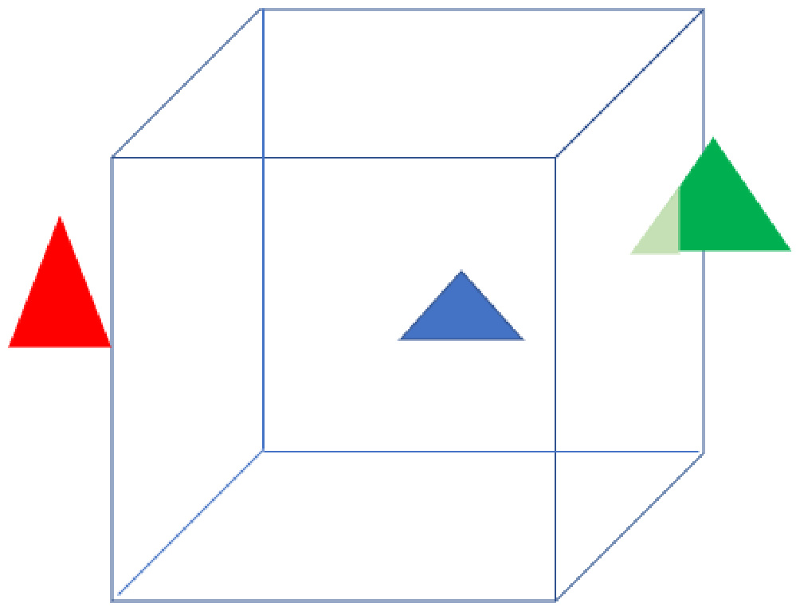  
Figure 7 – triangles intersecting View volume in Clip space  

Clipping removes all vertices outside of the view volume.  

In Figure 8, the view volume is drawn with the red triangle deleted, the blue triangle is unchanged, and the vertices on the green triangle outside the view volume were deleted and two new vertices added, shown as black dots.  

At this point in the rendering pipeline, OpenGL has a list of triangles, which are all in front of the camera, excluding vertices outside of the view volume.  

  
Figure 8 – clipped triangles with View volume in Clip space  

# Perspective Divide  

ecall from Chapter 6 that perspective division transforms a vertex to Normalised Devise Coordinate NDC space, as shown in Figure 9.  

# 1, 1, 1  

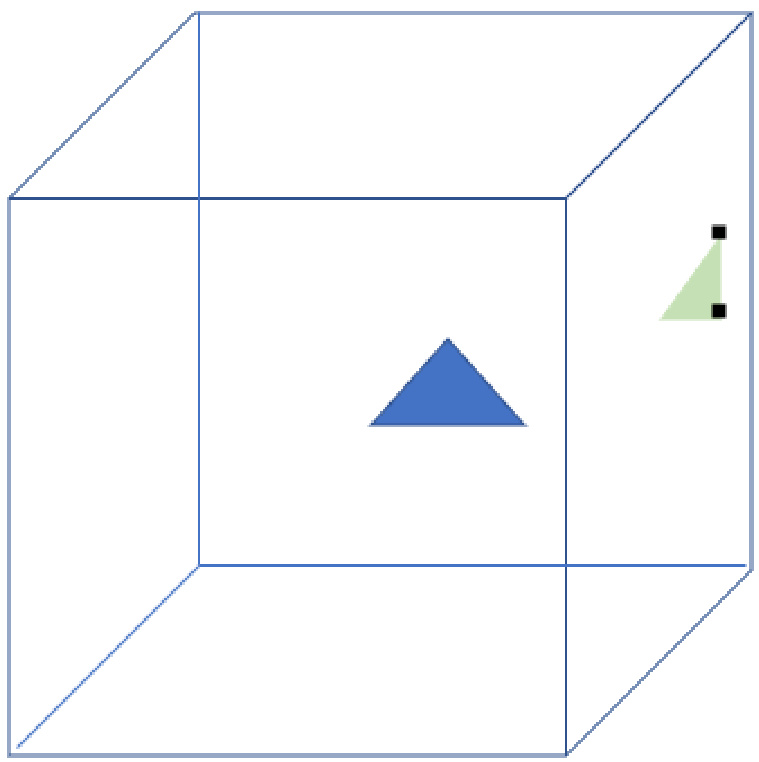  
Figure 9 –triangles with View volume in NDC space  

-1, -1, -1  

# Viewport transformation  

Recall from Chapter 6 that vertices in NDC space are transformed to screen space using the viewport transformation.  

After vertex postprocessing the triangles are in 2D screen space, with an additional z component which is used for depth testing, and a homogeneous coordinate of 1.   
Triangles in screen space, as shown in Figure 10, are rasterised.  

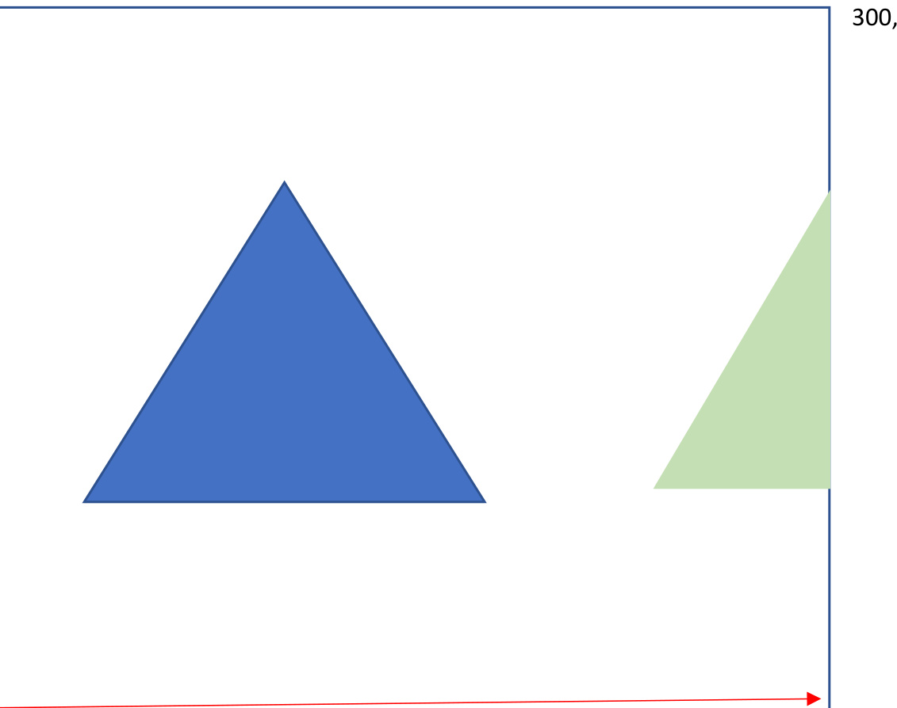  
Figure 10 – triangles in screen space  

# Rasterisation  

In the rasterisation stage the triangles are rasterised. Recall from Chapter 2 that Rasterisation is the process that calculates which pixels on the screen are contained in a triangle that is being rendered and each pixel inside a triangle is called a fragment.  

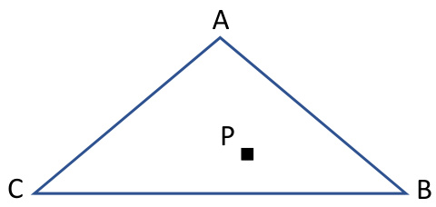  

The rasterise pseudocode is detailed in Chapter 2.  

# Pixel Processing Stage  

The Pixel Processing stage is made up of the following:  

1. Fragment Shader.   
2. Merging.  

# Fragment Shader  

Rasterisation produces a list of fragments, which are processed by a fragment shader to compute the colour of each fragment.  

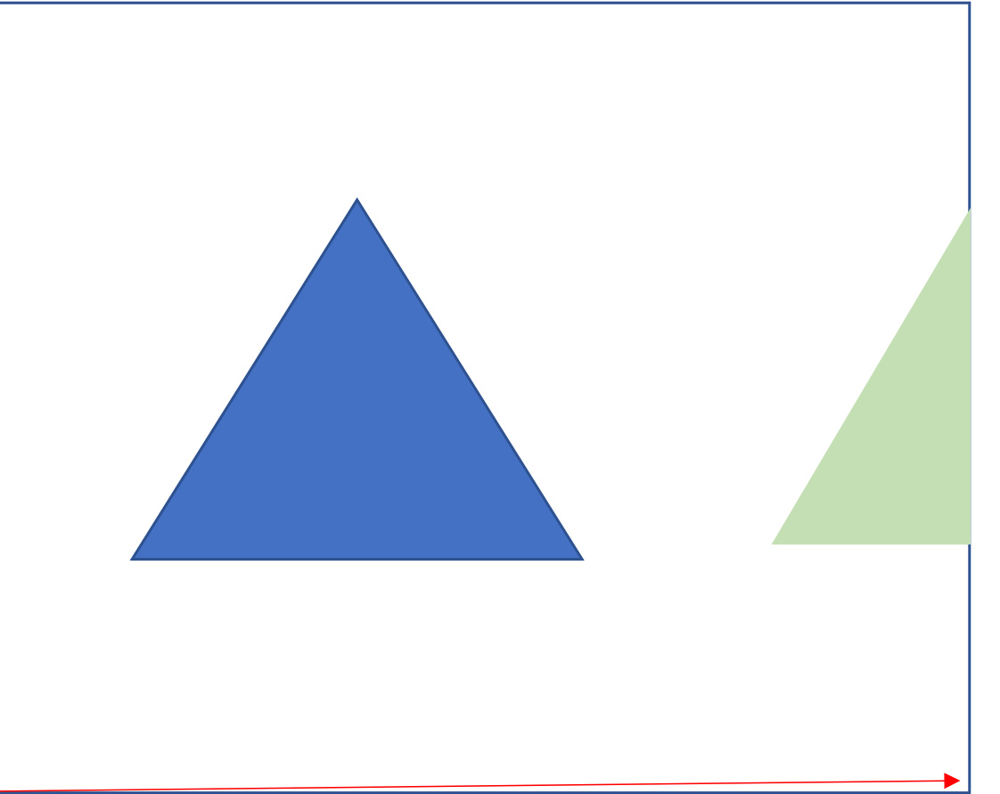  
Figure 11 – A blue and green coloured triangle  

0, 0  

Figure 11 shows an example render of two triangles. The fragment shader in this case just returns the colour blue and green for each fragment in the respective triangles shown.  

It is common for the fragment shader to sample texture colours or calculate the amount of light reaching a fragment from a light source, which will be covered in later chapters.  

# Merging  

Only the parts of triangles visible to the viewer should be displayed. Merging combines the fragment colour produced by the fragment shader with the colour already stored in the colour buffer.  

12 shows what happens when a red triangle is rendered first and then a blue triangle rendered second. The actual geometry is what is shown in Figure 13.  

300, 200  

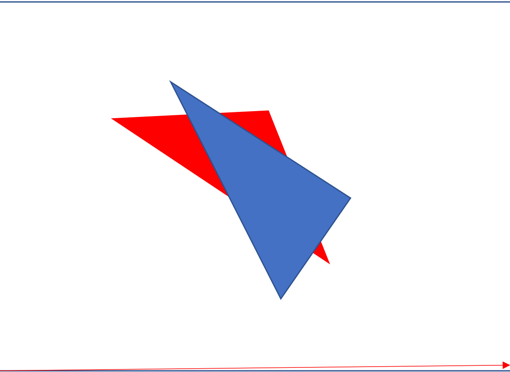  
Figure 12 – Two incorrectly rendered overlapping triangles  

Visibility is resolved using the z-buffer (Catmull , 1975).  

The z-buffer is the same size as the colour buffer, and each element is initialised to $+\infty$ .  

• If the z-value of a new fragment is less than the z-value currently stored in the z-buffer, then the colour in the colour buffer is updated with the fragment colour and the z-value of the fragment is stored in the z-buffer at that pixel and replaces the existing z-value.   
• If the z-value of a new fragment is greater than the z value currently stored in the z-buffer, this means the current fragment is behind a fragment which was previously computed, and nothing is changed in the z-buffer or colour buffer.  

In Figure 13 a red and blue triangle are intersecting, and the tip of the blue triangle is in front of the red triangle, and the tip of the red triangle is in front of the blue riangle. For the colour buffer to be displayed correctly, the red fragment colour labelled in the figure needs to be stored in the colour buffer but not the blue fragment colour.  

If the red triangle was drawn first then the colour buffer was empty and the red triangle fragment colours were all copied to the colour buffer, and when the blue triangle was drawn then the z-value of the blue fragment was greater than the z-value in the z-buffer, and z-buffer and colour-buffers are not modified.  

If the blue triangle was drawn first then the colour buffer was empty and the blue fragments were all copied to the colour buffer, and when the red triangle was drawn then the z-value of the red fragment was less than the z-value in the z-buffer, and then the colour and z-value for the red fragment replace the values in the colour buffer and zbuffer.  

In this way the colour buffer is calculated and displayed correctly.  

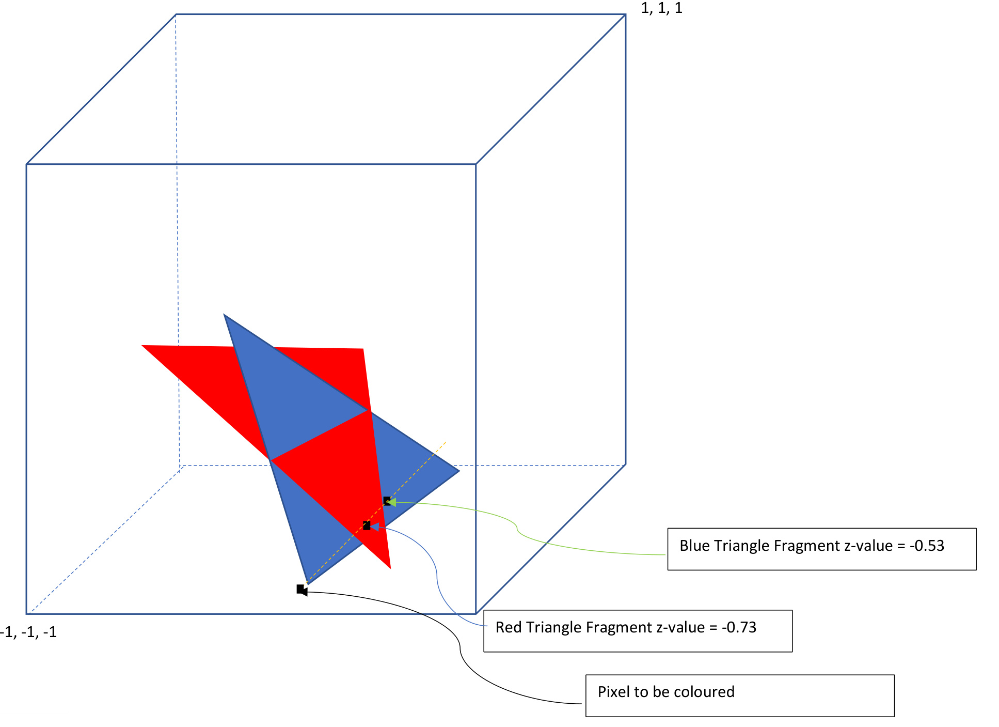  
Figure 13 – Two overlapping triangles  

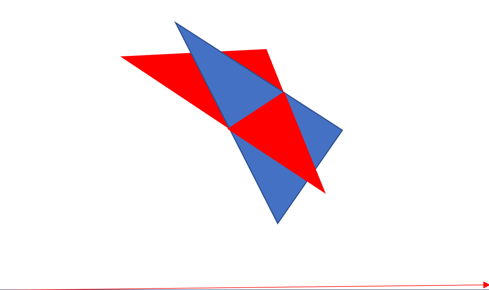  
Figure 14 – Two correctly rendered overlapping triangles  

0, 0  

fter the merging stage only the visible fragments of triangles are coloured at the respective pixel locations, as shown in Figure 14.   
Additionally, the z-buffer stores the depth of the closest fragments.   
At this point in the rendering pipeline a colour buffer has been produced which can be displayed on the screen.  

# Chapter Index  

application stage, 4   
Clipping, 11   
Merging, 18   
Pixel Processing stage, 16   
rasterisation stage, 15   
Rendering Pipeline, 2   
vertex Post processing, 9   
Vertex Processing stage, 5   
view volume, 8   
z-buffer, 19  

# Bibliography  

Catmull , E. (1975). Computer Display of Curved Surfaces. IEEE Conference on Computer Graphics, Pattern Recognition and Data Structures, (pp. 11-17).  